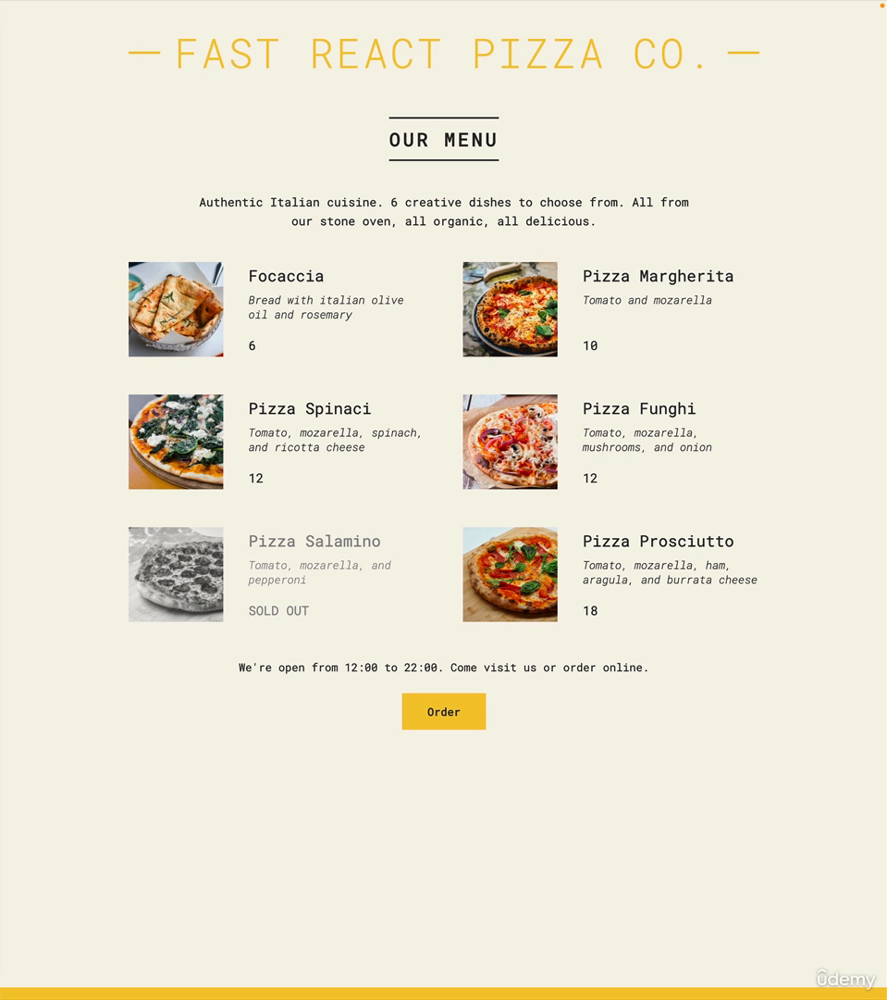

| Index                                                   |                                                        |
| ------------------------------------------------------- | ------------------------------------------------------ |
| 32. [Section Overview](#32)                             | 44. [CHALLENGE #1: Profile Card (v1)](#44)             |
| 33. [Rendering the Root Component and Strict Mode](#33) | 45. [The Rules of JSX](#45)                            |
| 34. [Before We Start Coding: Debugging](#34)            | 46. [Rendering Lists](#46)                             |
| 35. [Components as Building Blocks](#35)                | 47. [Conditional Rendering With &&](#47)               |
| 36. [Creating And Reusing a Component](#36)             | 48. [Conditional Rendering With Ternaries](#48)        |
| 37. [What is JSX?](#37)                                 | 49. [Conditional Rendering With Multiple Returns](#49) |
| 38. [Creating More Components](#38)                     | 50. [Extracting JSX Into a New Component](#50)         |
| 39. [JavaScript Logic in Components](#39)               | 51. [Destructuring Props](#51)                         |
| 40. [Separation of Concerns](#40)                       | 52. [React Fragments](#52)                             |
| 41. [Styling React Applications](#41)                   | 53. [Setting Classes and Text Conditionally](#53)      |
| 42. [Passing and Receiving Props](#42)                  | 54. [Section Summary](#54)                             |
| 43. [Props, Immutability, and One-Way Data Flow](#43)   | 55. [CHALLENGE #2: Profile Card (v2)](#55)             |

<br>

### 32. Section Overview<a id='32'></a>



<br>

### 33. Rendering the Root Component and Strict Mode<a id='33'></a>

- run cmd to create react app

```
npx create-react-app pizza-menu
cd pizza-menu
npm start
```

- remove src folder
- create src folder in rootlevel
- In src folder create index.js,
  - import react library
  - create App component
  - render component by targeting "root" id

```js
import React from "react";
import ReactDOM from "react-dom/client";

function App() {
  return <h1>Hello React!</h1>;
}

// React v18
const root = ReactDOM.createRoot(document.getElementById("root"));
root.render(
  <React.StrictMode>
    <App />
  </React.StrictMode>
);

// React before 18
// ReactDOM.render(<App />, document.getElementById("root"));
```

<br>

### 34. Before We Start Coding: Debugging<a id='34'></a>

#### Possible solution to deal with react project problem

1. check dev-server is running
1. restart dev-server
1. hard reload the chrome browser
1. chrome dev-tool-> console
1. termnal linter error copy and paste to google, look for stack overflow recent year

<br>

### 35. Components as Building Blocks<a id='35'></a>

- ref. slide
  <br>

### 36. Creating And Reusing a Component<a id='36'></a>

- from starter folder copy all resource and paste in project/public folder
- move index.css file from public to src folder
- copy from public/data.js data and paste in src/index.js
- In src/index.js, create Pizza reusable component

```js
import React from "react";
import ReactDOM from "react-dom/client";

const pizzaData = [
  {
    name: "Focaccia",
    ingredients: "Bread with italian olive oil and rosemary",
    price: 6,
    photoName: "pizzas/focaccia.jpg",
    soldOut: false,
  },
  {
    name: "Pizza Margherita",
    ingredients: "Tomato and mozarella",
    price: 10,
    photoName: "pizzas/margherita.jpg",
    soldOut: false,
  },
  {
    name: "Pizza Spinaci",
    ingredients: "Tomato, mozarella, spinach, and ricotta cheese",
    price: 12,
    photoName: "pizzas/spinaci.jpg",
    soldOut: false,
  },
  {
    name: "Pizza Funghi",
    ingredients: "Tomato, mozarella, mushrooms, and onion",
    price: 12,
    photoName: "pizzas/funghi.jpg",
    soldOut: false,
  },
  {
    name: "Pizza Salamino",
    ingredients: "Tomato, mozarella, and pepperoni",
    price: 15,
    photoName: "pizzas/salamino.jpg",
    soldOut: true,
  },
  {
    name: "Pizza Prosciutto",
    ingredients: "Tomato, mozarella, ham, aragula, and burrata cheese",
    price: 18,
    photoName: "pizzas/prosciutto.jpg",
    soldOut: false,
  },
];

function App() {
  return (
    <div className="container">
      <Pizza />
      <Pizza />
      <Pizza />
    </div>
  );
}

function Pizza() {
  return (
    <div>
      
      <h3>Pizza Prosciutto</h3>
      <p>Tomato, mozarella, ham, aragula, and burrata cheese</p>
    </div>
  );
}

// React v18
const root = ReactDOM.createRoot(document.getElementById("root"));
root.render(
  <React.StrictMode>
    <App />
  </React.StrictMode>
);

// React before 18
// ReactDOM.render(<App />, document.getElementById("root"));
```

<br>

### 37. What is JSX?<a id='37'></a>

- ref. slides

<br>

### 38. Creating More Components<a id='38'></a>

- In src/index.js create simple Header, Menu, Footer component and nest them in App component

```js
import React from "react";
import ReactDOM from "react-dom/client";

const pizzaData = [
  {
    name: "Focaccia",
    ingredients: "Bread with italian olive oil and rosemary",
    price: 6,
    photoName: "pizzas/focaccia.jpg",
    soldOut: false,
  },
  {
    name: "Pizza Margherita",
    ingredients: "Tomato and mozarella",
    price: 10,
    photoName: "pizzas/margherita.jpg",
    soldOut: false,
  },
  {
    name: "Pizza Spinaci",
    ingredients: "Tomato, mozarella, spinach, and ricotta cheese",
    price: 12,
    photoName: "pizzas/spinaci.jpg",
    soldOut: false,
  },
  {
    name: "Pizza Funghi",
    ingredients: "Tomato, mozarella, mushrooms, and onion",
    price: 12,
    photoName: "pizzas/funghi.jpg",
    soldOut: false,
  },
  {
    name: "Pizza Salamino",
    ingredients: "Tomato, mozarella, and pepperoni",
    price: 15,
    photoName: "pizzas/salamino.jpg",
    soldOut: true,
  },
  {
    name: "Pizza Prosciutto",
    ingredients: "Tomato, mozarella, ham, aragula, and burrata cheese",
    price: 18,
    photoName: "pizzas/prosciutto.jpg",
    soldOut: false,
  },
];

function App() {
  return (
    <div className="container">
      <Header />
      <Menu />
      <Footer />
    </div>
  );
}

function Header() {
  return <h1>Fast React Pizza Co.</h1>;
}

function Menu() {
  return (
    <div>
      <h2>Our menu</h2>
      <Pizza />
      <Pizza />
      <Pizza />
    </div>
  );
}

function Pizza() {
  return (
    <div>
      
      <h3>Pizza Prosciutto</h3>
      <p>Tomato, mozarella, ham, aragula, and burrata cheese</p>
    </div>
  );
}

function Footer() {
  return <footer>{new Date().toLocaleTimeString} We/re currently open</footer>;

  // return React.createElement("footer", null, "We're currently open!");
}

// React v18
const root = ReactDOM.createRoot(document.getElementById("root"));
root.render(
  <React.StrictMode>
    <App />
  </React.StrictMode>
);

// React before 18
// ReactDOM.render(<App />, document.getElementById("root"));
```

- ref. [Using toLocaleTimeString()](https://developer.mozilla.org/en-US/docs/Web/JavaScript/Reference/Global_Objects/Date/toLocaleTimeString)

<br>

### 39. JavaScript Logic in Components<a id='39'></a>

- In src/index.js, inside Footer component write opening time & closing time logic

```js
import React from "react";
import ReactDOM from "react-dom/client";

const pizzaData = [
  {
    name: "Focaccia",
    ingredients: "Bread with italian olive oil and rosemary",
    price: 6,
    photoName: "pizzas/focaccia.jpg",
    soldOut: false,
  },
  {
    name: "Pizza Margherita",
    ingredients: "Tomato and mozarella",
    price: 10,
    photoName: "pizzas/margherita.jpg",
    soldOut: false,
  },
  {
    name: "Pizza Spinaci",
    ingredients: "Tomato, mozarella, spinach, and ricotta cheese",
    price: 12,
    photoName: "pizzas/spinaci.jpg",
    soldOut: false,
  },
  {
    name: "Pizza Funghi",
    ingredients: "Tomato, mozarella, mushrooms, and onion",
    price: 12,
    photoName: "pizzas/funghi.jpg",
    soldOut: false,
  },
  {
    name: "Pizza Salamino",
    ingredients: "Tomato, mozarella, and pepperoni",
    price: 15,
    photoName: "pizzas/salamino.jpg",
    soldOut: true,
  },
  {
    name: "Pizza Prosciutto",
    ingredients: "Tomato, mozarella, ham, aragula, and burrata cheese",
    price: 18,
    photoName: "pizzas/prosciutto.jpg",
    soldOut: false,
  },
];

function App() {
  return (
    <div className="container">
      <Header />
      <Menu />
      <Footer />
    </div>
  );
}

function Header() {
  return <h1>Fast React Pizza Co.</h1>;
}

function Menu() {
  return (
    <div>
      <h2>Our menu</h2>
      <Pizza />
      <Pizza />
      <Pizza />
    </div>
  );
}

function Pizza() {
  return (
    <div>
      
      <h3>Pizza Prosciutto</h3>
      <p>Tomato, mozarella, ham, aragula, and burrata cheese</p>
    </div>
  );
}

function Footer() {
  const hour = new Date().getHours();
  const openHour = 12;
  const closeHour = 22;
  const isOpen = hour >= openHour && hour <= closeHour;
  console.log(isOpen);

  // if (hour >= openHour && hour <= closeHour) alert("We're currently open!");
  // else alert("Sorry we're closed");

  return <footer>{new Date().toLocaleTimeString}. We/re currently open</footer>;

  // return React.createElement("footer", null, "We're currently open!");
}

// React v18
const root = ReactDOM.createRoot(document.getElementById("root"));
root.render(
  <React.StrictMode>
    <App />
  </React.StrictMode>
);

// React before 18
// ReactDOM.render(<App />, document.getElementById("root"));
```

<br>

### 40. Separation of Concerns<a id='40'></a>

- ref. slides

<br>

### 41. Styling React Applications<a id='41'></a>

- In src/index.js
  - import index.css
  - try js-obj inline style pn footer component
  - apply global styles using external style sheet

```js
import React from "react";
import ReactDOM from "react-dom/client";
import "./index.css";

const pizzaData = [
  {
    name: "Focaccia",
    ingredients: "Bread with italian olive oil and rosemary",
    price: 6,
    photoName: "pizzas/focaccia.jpg",
    soldOut: false,
  },
  {
    name: "Pizza Margherita",
    ingredients: "Tomato and mozarella",
    price: 10,
    photoName: "pizzas/margherita.jpg",
    soldOut: false,
  },
  {
    name: "Pizza Spinaci",
    ingredients: "Tomato, mozarella, spinach, and ricotta cheese",
    price: 12,
    photoName: "pizzas/spinaci.jpg",
    soldOut: false,
  },
  {
    name: "Pizza Funghi",
    ingredients: "Tomato, mozarella, mushrooms, and onion",
    price: 12,
    photoName: "pizzas/funghi.jpg",
    soldOut: false,
  },
  {
    name: "Pizza Salamino",
    ingredients: "Tomato, mozarella, and pepperoni",
    price: 15,
    photoName: "pizzas/salamino.jpg",
    soldOut: true,
  },
  {
    name: "Pizza Prosciutto",
    ingredients: "Tomato, mozarella, ham, aragula, and burrata cheese",
    price: 18,
    photoName: "pizzas/prosciutto.jpg",
    soldOut: false,
  },
];

function App() {
  return (
    <div className="container">
      <Header />
      <Menu />
      <Footer />
    </div>
  );
}

function Header() {
  // const style = { color: "red", fontSize: "48px", textTransform: "uppercase" };
  const style = {};

  return (
    <header className="header">
      <h1 style={style}>Fast React Pizza Co.</h1>
    </header>
  );
}

function Menu() {
  return (
    <main className="menu">
      <h2>Our menu</h2>
      <Pizza />
      <Pizza />
      <Pizza />
    </main>
  );
}

function Pizza() {
  return (
    <div>
      
      <h3>Pizza Prosciutto</h3>
      <p>Tomato, mozarella, ham, aragula, and burrata cheese</p>
    </div>
  );
}

function Footer() {
  const hour = new Date().getHours();
  const openHour = 12;
  const closeHour = 22;
  const isOpen = hour >= openHour && hour <= closeHour;
  console.log(isOpen);

  // if (hour >= openHour && hour <= closeHour) alert("We're currently open!");
  // else alert("Sorry we're closed");

  return (
    <footer className="footer">
      {new Date().toLocaleTimeString}. We/re currently open
    </footer>
  );

  // return React.createElement("footer", null, "We're currently open!");
}

// React v18
const root = ReactDOM.createRoot(document.getElementById("root"));
root.render(
  <React.StrictMode>
    <App />
  </React.StrictMode>
);

// React before 18
// ReactDOM.render(<App />, document.getElementById("root"));
```

<br>

### 42. Passing and Receiving Props<a id='42'></a>

- pass data from parent component to child component
- In src/index.js,
  - pass data from Pizza component, which is in Menu component
  - change Pizza component to receive props and setup props
  -

```js
import React from "react";
import ReactDOM from "react-dom/client";
import "./index.css";

const pizzaData = [
  {
    name: "Focaccia",
    ingredients: "Bread with italian olive oil and rosemary",
    price: 6,
    photoName: "pizzas/focaccia.jpg",
    soldOut: false,
  },
  {
    name: "Pizza Margherita",
    ingredients: "Tomato and mozarella",
    price: 10,
    photoName: "pizzas/margherita.jpg",
    soldOut: false,
  },
  {
    name: "Pizza Spinaci",
    ingredients: "Tomato, mozarella, spinach, and ricotta cheese",
    price: 12,
    photoName: "pizzas/spinaci.jpg",
    soldOut: false,
  },
  {
    name: "Pizza Funghi",
    ingredients: "Tomato, mozarella, mushrooms, and onion",
    price: 12,
    photoName: "pizzas/funghi.jpg",
    soldOut: false,
  },
  {
    name: "Pizza Salamino",
    ingredients: "Tomato, mozarella, and pepperoni",
    price: 15,
    photoName: "pizzas/salamino.jpg",
    soldOut: true,
  },
  {
    name: "Pizza Prosciutto",
    ingredients: "Tomato, mozarella, ham, aragula, and burrata cheese",
    price: 18,
    photoName: "pizzas/prosciutto.jpg",
    soldOut: false,
  },
];

function App() {
  return (
    <div className="container">
      <Header />
      <Menu />
      <Footer />
    </div>
  );
}

function Header() {
  // const style = { color: "red", fontSize: "48px", textTransform: "uppercase" };
  const style = {};

  return (
    <header className="header">
      <h1 style={style}>Fast React Pizza Co.</h1>
    </header>
  );
}

function Menu() {
  return (
    <main className="menu">
      <h2>Our menu</h2>
      <Pizza
        name="Pizza Spinaci"
        ingredients="Tomato, mozarella, spinach, and ricotta cheese"
        price={12}
        photoName="pizzas/spinaci.jpg"
      />

      <Pizza
        name="Pizza Prosciutto"
        ingredients="Tomato, mozarella, ham, aragula, and burrata cheese"
        price={18}
        photoName="pizzas/prosciutto.jpg"
      />
    </main>
  );
}

function Pizza(props) {
  console.log(pizzaObj);
  return (
    <div className="pizza">
      
      <div>
        <h3>{props.name}</h3>
        <p>{props.ingredients}</p>
        <span>{props.price + 3}</span>
      </div>
    </div>
  );
}

function Footer() {
  const hour = new Date().getHours();
  const openHour = 12;
  const closeHour = 22;
  const isOpen = hour >= openHour && hour <= closeHour;
  console.log(isOpen);

  // if (hour >= openHour && hour <= closeHour) alert("We're currently open!");
  // else alert("Sorry we're closed");

  return (
    <footer className="footer">
      {new Date().toLocaleTimeString}. We/re currently open
    </footer>
  );

  // return React.createElement("footer", null, "We're currently open!");
}

// React v18
const root = ReactDOM.createRoot(document.getElementById("root"));
root.render(
  <React.StrictMode>
    <App />
  </React.StrictMode>
);

// React before 18
// ReactDOM.render(<App />, document.getElementById("root"));
```

<br>

### 43. Props, Immutability, and One-Way Data Flow<a id='43'></a>

- ref. slides

<br>

### 44. CHALLENGE #1: Profile Card (v1)<a id='44'></a>


- [Project link](https://codesandbox.io/s/react-challenge-dev-profile-final-v1-8szvtk?file=/src/index.js:0-1488)

- src/index.js

```js
import { StrictMode } from "react";
import { createRoot } from "react-dom/client";
import "./styles.css";

function App() {
  return (
    <div className="card">
      <Avatar />
      <div className="data">
        <Intro />
        {/* Should contain one Skill component
        for each web dev skill that you have,
        customized with props */}
        <SkillList />
      </div>
    </div>
  );
}

function Avatar() {
  return ;
}

function Intro() {
  return (
    <div>
      <h1>Jonas Schmedtmann</h1>
      <p>
        Full-stack web developer and teacher at Udemy. When not coding or
        preparing a course, I like to play board games, to cook (and eat), or to
        just enjoy the Portuguese sun at the beach.
      </p>
    </div>
  );
}

function SkillList() {
  return (
    <div className="skill-list">
      <Skill skill="React" emoji="💪" color="blue" />
      <Skill skill="HTML+CSS" emoji="💪" color="orange" />
      <Skill skill="JavaScript" emoji="💪" color="yellow" />
      <Skill skill="Svelte" emoji="👶" color="orangered" />
    </div>
  );
}

function Skill(props) {
  return (
    <div className="skill" style={{ backgroundColor: props.color }}>
      <span>{props.skill}</span>
      <span>{props.emoji}</span>
    </div>
  );
}

const rootElement = document.getElementById("root");
const root = createRoot(rootElement);

root.render(
  <StrictMode>
    <App />
  </StrictMode>
);
```

---

- In src/index.css

```css
@import url("https://fonts.googleapis.com/css2?family=IBM+Plex+Mono:wght@300;400;500&display=swap");

* {
  margin: 0;
  padding: 0;
  box-sizing: border-box;
}

body {
  font-family: "IBM Plex Mono", sans-serif;
  background-color: #f7f7f7;
}

h1 {
  margin-bottom: 12px;
}

.card {
  width: 450px;
  margin: 40px;
  border: 4px solid #222;
}

.card::after {
  content: "";
  display: block;
}

.avatar {
  width: 100%;
  display: block;
}

.data {
  padding: 32px;
  padding-top: 24px;
}

.skill-list {
  list-style: none;
  display: flex;
  flex-wrap: wrap;
  gap: 8px;
  margin-top: 16px;
}

.skill {
  padding: 2px 12px;
  border-radius: 5px;
  display: flex;
  align-items: center;
  gap: 8px;
  font-weight: 500;
}
```

<br>

### 45. The Rules of JSX<a id='45'></a>

- ref. slides

<br>

### 46. Rendering Lists<a id='46'></a>

- In src/index.js, render pizza list by passing props from parent to child component

```js
import React from "react";
import ReactDOM from "react-dom/client";
import "./index.css";

const pizzaData = [
  {
    name: "Focaccia",
    ingredients: "Bread with italian olive oil and rosemary",
    price: 6,
    photoName: "pizzas/focaccia.jpg",
    soldOut: false,
  },
  {
    name: "Pizza Margherita",
    ingredients: "Tomato and mozarella",
    price: 10,
    photoName: "pizzas/margherita.jpg",
    soldOut: false,
  },
  {
    name: "Pizza Spinaci",
    ingredients: "Tomato, mozarella, spinach, and ricotta cheese",
    price: 12,
    photoName: "pizzas/spinaci.jpg",
    soldOut: false,
  },
  {
    name: "Pizza Funghi",
    ingredients: "Tomato, mozarella, mushrooms, and onion",
    price: 12,
    photoName: "pizzas/funghi.jpg",
    soldOut: false,
  },
  {
    name: "Pizza Salamino",
    ingredients: "Tomato, mozarella, and pepperoni",
    price: 15,
    photoName: "pizzas/salamino.jpg",
    soldOut: true,
  },
  {
    name: "Pizza Prosciutto",
    ingredients: "Tomato, mozarella, ham, aragula, and burrata cheese",
    price: 18,
    photoName: "pizzas/prosciutto.jpg",
    soldOut: false,
  },
];

function App() {
  return (
    <div className="container">
      <Header />
      <Menu />
      <Footer />
    </div>
  );
}

function Header() {
  // const style = { color: "red", fontSize: "48px", textTransform: "uppercase" };
  const style = {};

  return (
    <header className="header">
      <h1 style={style}>Fast React Pizza Co.</h1>
    </header>
  );
}

function Menu() {
  return (
    <main className="menu">
      <h2>Our menu</h2>

      <ul className="pizzas">
        {pizzas.map((pizza) => (
          <Pizza pizzaObj={pizza} key={pizza.name} />
        ))}
      </ul>
    </main>
  );
}

function Pizza(props) {
  console.log(pizzaObj);

  return (
    <li className="pizza">
      
      <div>
        <h3>{pizzaObj.name}</h3>
        <p>{pizzaObj.ingredients}</p>
        <span>{pizzaObj.price}</span>
      </div>
    </li>
  );
}

function Footer() {
  const hour = new Date().getHours();
  const openHour = 12;
  const closeHour = 22;
  const isOpen = hour >= openHour && hour <= closeHour;
  console.log(isOpen);

  // if (hour >= openHour && hour <= closeHour) alert("We're currently open!");
  // else alert("Sorry we're closed");

  return (
    <footer className="footer">
      {new Date().toLocaleTimeString}. We/re currently open
    </footer>
  );

  // return React.createElement("footer", null, "We're currently open!");
}

// React v18
const root = ReactDOM.createRoot(document.getElementById("root"));
root.render(
  <React.StrictMode>
    <App />
  </React.StrictMode>
);

// React before 18
// ReactDOM.render(<App />, document.getElementById("root"));
```

- <br>

### 47. Conditional Rendering With &&<a id='47'></a>

- In src/index.js

```js
import React from "react";
import ReactDOM from "react-dom/client";
import "./index.css";

const pizzaData = [
  {
    name: "Focaccia",
    ingredients: "Bread with italian olive oil and rosemary",
    price: 6,
    photoName: "pizzas/focaccia.jpg",
    soldOut: false,
  },
  {
    name: "Pizza Margherita",
    ingredients: "Tomato and mozarella",
    price: 10,
    photoName: "pizzas/margherita.jpg",
    soldOut: false,
  },
  {
    name: "Pizza Spinaci",
    ingredients: "Tomato, mozarella, spinach, and ricotta cheese",
    price: 12,
    photoName: "pizzas/spinaci.jpg",
    soldOut: false,
  },
  {
    name: "Pizza Funghi",
    ingredients: "Tomato, mozarella, mushrooms, and onion",
    price: 12,
    photoName: "pizzas/funghi.jpg",
    soldOut: false,
  },
  {
    name: "Pizza Salamino",
    ingredients: "Tomato, mozarella, and pepperoni",
    price: 15,
    photoName: "pizzas/salamino.jpg",
    soldOut: true,
  },
  {
    name: "Pizza Prosciutto",
    ingredients: "Tomato, mozarella, ham, aragula, and burrata cheese",
    price: 18,
    photoName: "pizzas/prosciutto.jpg",
    soldOut: false,
  },
];

function App() {
  return (
    <div className="container">
      <Header />
      <Menu />
      <Footer />
    </div>
  );
}

function Header() {
  // const style = { color: "red", fontSize: "48px", textTransform: "uppercase" };
  const style = {};

  return (
    <header className="header">
      <h1 style={style}>Fast React Pizza Co.</h1>
    </header>
  );
}

function Menu() {
  const pizzas = pizzaData;
  // const pizzas = [];
  const numPizzas = pizzas.length;

  return (
    <main className="menu">
      <h2>Our menu</h2>

      {numPizzas > 0 && (
        <ul className="pizzas">
          {pizzas.map((pizza) => (
            <Pizza pizzaObj={pizza} key={pizza.name} />
          ))}
        </ul>
      )}
    </main>
  );
}

function Pizza(props) {
  console.log(pizzaObj);

  return (
    <li className="pizza">
      
      <div>
        <h3>{pizzaObj.name}</h3>
        <p>{pizzaObj.ingredients}</p>
        <span>{pizzaObj.price}</span>
      </div>
    </li>
  );
}

function Footer() {
  const hour = new Date().getHours();
  const openHour = 12;
  const closeHour = 22;
  const isOpen = hour >= openHour && hour <= closeHour;
  console.log(isOpen);

  // if (hour >= openHour && hour <= closeHour) alert("We're currently open!");
  // else alert("Sorry we're closed");

  return (
    <footer className="footer">
      {isOpen && (
        <div className="order">
          <p>We're happy to welcome you between {closeHour}:00.</p>
          <button className="btn">Order</button>
        </div>
      )}
    </footer>
  );

  // return React.createElement("footer", null, "We're currently open!");
}

// React v18
const root = ReactDOM.createRoot(document.getElementById("root"));
root.render(
  <React.StrictMode>
    <App />
  </React.StrictMode>
);

// React before 18
// ReactDOM.render(<App />, document.getElementById("root"));
```

<br>

### 48. Conditional Rendering With Ternaries<a id='48'></a>

- In src/index.js, in Menu, Footer component

```js
import React from "react";
import ReactDOM from "react-dom/client";
import "./index.css";

const pizzaData = [
  {
    name: "Focaccia",
    ingredients: "Bread with italian olive oil and rosemary",
    price: 6,
    photoName: "pizzas/focaccia.jpg",
    soldOut: false,
  },
  {
    name: "Pizza Margherita",
    ingredients: "Tomato and mozarella",
    price: 10,
    photoName: "pizzas/margherita.jpg",
    soldOut: false,
  },
  {
    name: "Pizza Spinaci",
    ingredients: "Tomato, mozarella, spinach, and ricotta cheese",
    price: 12,
    photoName: "pizzas/spinaci.jpg",
    soldOut: false,
  },
  {
    name: "Pizza Funghi",
    ingredients: "Tomato, mozarella, mushrooms, and onion",
    price: 12,
    photoName: "pizzas/funghi.jpg",
    soldOut: false,
  },
  {
    name: "Pizza Salamino",
    ingredients: "Tomato, mozarella, and pepperoni",
    price: 15,
    photoName: "pizzas/salamino.jpg",
    soldOut: true,
  },
  {
    name: "Pizza Prosciutto",
    ingredients: "Tomato, mozarella, ham, aragula, and burrata cheese",
    price: 18,
    photoName: "pizzas/prosciutto.jpg",
    soldOut: false,
  },
];

function App() {
  return (
    <div className="container">
      <Header />
      <Menu />
      <Footer />
    </div>
  );
}

function Header() {
  // const style = { color: "red", fontSize: "48px", textTransform: "uppercase" };
  const style = {};

  return (
    <header className="header">
      <h1 style={style}>Fast React Pizza Co.</h1>
    </header>
  );
}

function Menu() {
  const pizzas = pizzaData;
  // const pizzas = [];
  const numPizzas = pizzas.length;

  return (
    <main className="menu">
      <h2>Our menu</h2>

      {numPizzas > 0 ? (
        <ul className="pizzas">
          {pizzas.map((pizza) => (
            <Pizza pizzaObj={pizza} key={pizza.name} />
          ))}
        </ul>
      ) : (
        <p>We're still working on our menu</p>
      )}
    </main>
  );
}

function Pizza(props) {
  console.log(pizzaObj);

  return (
    <li className="pizza">
      
      <div>
        <h3>{pizzaObj.name}</h3>
        <p>{pizzaObj.ingredients}</p>
        <span>{pizzaObj.price}</span>
      </div>
    </li>
  );
}

function Footer() {
  const hour = new Date().getHours();
  const openHour = 12;
  const closeHour = 22;
  const isOpen = hour >= openHour && hour <= closeHour;
  console.log(isOpen);

  // if (hour >= openHour && hour <= closeHour) alert("We're currently open!");
  // else alert("Sorry we're closed");

  return (
    <footer className="footer">
      {isOpen ? (
        <div className="order">
          <p>We're are open until {closeHour}:00.</p>
          <button className="btn">Order</button>
        </div>
      ) : (
        <p>
          We're happy to welcome you between {openHour}:00 and {closeHour}:00.
        </p>
      )}
    </footer>
  );

  // return React.createElement("footer", null, "We're currently open!");
}

// React v18
const root = ReactDOM.createRoot(document.getElementById("root"));
root.render(
  <React.StrictMode>
    <App />
  </React.StrictMode>
);

// React before 18
// ReactDOM.render(<App />, document.getElementById("root"));
```

<br>

### 49. Conditional Rendering With Multiple Returns<a id='49'></a>

- In src/index.js, conditional rendering in Pizza component

```js
import React from "react";
import ReactDOM from "react-dom/client";
import "./index.css";

const pizzaData = [
  {
    name: "Focaccia",
    ingredients: "Bread with italian olive oil and rosemary",
    price: 6,
    photoName: "pizzas/focaccia.jpg",
    soldOut: false,
  },
  {
    name: "Pizza Margherita",
    ingredients: "Tomato and mozarella",
    price: 10,
    photoName: "pizzas/margherita.jpg",
    soldOut: false,
  },
  {
    name: "Pizza Spinaci",
    ingredients: "Tomato, mozarella, spinach, and ricotta cheese",
    price: 12,
    photoName: "pizzas/spinaci.jpg",
    soldOut: false,
  },
  {
    name: "Pizza Funghi",
    ingredients: "Tomato, mozarella, mushrooms, and onion",
    price: 12,
    photoName: "pizzas/funghi.jpg",
    soldOut: false,
  },
  {
    name: "Pizza Salamino",
    ingredients: "Tomato, mozarella, and pepperoni",
    price: 15,
    photoName: "pizzas/salamino.jpg",
    soldOut: true,
  },
  {
    name: "Pizza Prosciutto",
    ingredients: "Tomato, mozarella, ham, aragula, and burrata cheese",
    price: 18,
    photoName: "pizzas/prosciutto.jpg",
    soldOut: false,
  },
];

function App() {
  return (
    <div className="container">
      <Header />
      <Menu />
      <Footer />
    </div>
  );
}

function Header() {
  // const style = { color: "red", fontSize: "48px", textTransform: "uppercase" };
  const style = {};

  return (
    <header className="header">
      <h1 style={style}>Fast React Pizza Co.</h1>
    </header>
  );
}

function Menu() {
  const pizzas = pizzaData;
  // const pizzas = [];
  const numPizzas = pizzas.length;

  return (
    <main className="menu">
      <h2>Our menu</h2>

      {numPizzas > 0 ? (
        <ul className="pizzas">
          {pizzas.map((pizza) => (
            <Pizza pizzaObj={pizza} key={pizza.name} />
          ))}
        </ul>
      ) : (
        <p>We're still working on our menu</p>
      )}
    </main>
  );
}

function Pizza(props) {
  console.log(pizzaObj);

  if (pizzaObj.soldOut) return null;

  return (
    <li className="pizza">
      
      <div>
        <h3>{pizzaObj.name}</h3>
        <p>{pizzaObj.ingredients}</p>
        <span>{pizzaObj.price}</span>
      </div>
    </li>
  );
}

function Footer() {
  const hour = new Date().getHours();
  const openHour = 12;
  const closeHour = 22;
  const isOpen = hour >= openHour && hour <= closeHour;
  console.log(isOpen);

  // if (hour >= openHour && hour <= closeHour) alert("We're currently open!");
  // else alert("Sorry we're closed");

  return (
    <footer className="footer">
      {isOpen ? (
        <div className="order">
          <p>We're are open until {closeHour}:00.</p>
          <button className="btn">Order</button>
        </div>
      ) : (
        <p>
          We're happy to welcome you between {openHour}:00 and {closeHour}:00.
        </p>
      )}
    </footer>
  );

  // return React.createElement("footer", null, "We're currently open!");
}

// React v18
const root = ReactDOM.createRoot(document.getElementById("root"));
root.render(
  <React.StrictMode>
    <App />
  </React.StrictMode>
);

// React before 18
// ReactDOM.render(<App />, document.getElementById("root"));
```

<br>

### 50. Extracting JSX Into a New Component<a id='50'></a>

<br>

### 51. Destructuring Props<a id='51'></a>

<br>

### 52. React Fragments<a id='52'></a>

<br>

### 53. Setting Classes and Text Conditionally<a id='53'></a>

<br>

### 54. Section Summary<a id='54'></a>

- ref slides

<br>

### 55. CHALLENGE #2: Profile Card (v2)<a id='55'></a>


- [Project link](https://codesandbox.io/s/react-challenge-dev-profile-final-v2-e8zj9o?file=/src/index.js:0-1979)

- In src/index.js

```js
import { StrictMode } from "react";
import { createRoot } from "react-dom/client";
import "./styles.css";

const skills = [
  {
    skill: "HTML+CSS",
    level: "advanced",
    color: "#2662EA",
  },
  {
    skill: "JavaScript",
    level: "advanced",
    color: "#EFD81D",
  },
  {
    skill: "Web Design",
    level: "advanced",
    color: "#C3DCAF",
  },
  {
    skill: "Git and GitHub",
    level: "intermediate",
    color: "#E84F33",
  },
  {
    skill: "React",
    level: "advanced",
    color: "#60DAFB",
  },
  {
    skill: "Svelte",
    level: "beginner",
    color: "#FF3B00",
  },
];

function App() {
  return (
    <div className="card">
      <Avatar />
      <div className="data">
        <Intro />
        {/* Should contain one Skill component
        for each web dev skill that you have,
        customized with props */}
        <SkillList />
      </div>
    </div>
  );
}

function Avatar() {
  return ;
}

function Intro() {
  return (
    <div>
      <h1>Jonas Schmedtmann</h1>
      <p>
        Full-stack web developer and teacher at Udemy. When not coding or
        preparing a course, I like to play board games, to cook (and eat), or to
        just enjoy the Portuguese sun at the beach.
      </p>
    </div>
  );
}

function SkillList() {
  return (
    <div className="skill-list">
      {skills.map((skill) => (
        <Skill skill={skill.skill} color={skill.color} level={skill.level} />
      ))}
    </div>
  );
}

function Skill({ skill, color, level }) {
  return (
    <div className="skill" style={{ backgroundColor: color }}>
      <span>{skill}</span>
      <span>
        {level === "beginner" && "👶"}
        {level === "intermediate" && "👍"}
        {level === "advanced" && "💪"}
      </span>
    </div>
  );
}

const rootElement = document.getElementById("root");
const root = createRoot(rootElement);

root.render(
  <StrictMode>
    <App />
  </StrictMode>
);
```

---

- In src/index.css

```css
@import url("https://fonts.googleapis.com/css2?family=IBM+Plex+Mono:wght@300;400;500&display=swap");

* {
  margin: 0;
  padding: 0;
  box-sizing: border-box;
}

body {
  font-family: "IBM Plex Mono", sans-serif;
  background-color: #f7f7f7;
}

h1 {
  margin-bottom: 12px;
}

.card {
  width: 450px;
  margin: 40px;
  border: 4px solid #222;
}

.card::after {
  content: "";
  display: block;
}

.avatar {
  width: 100%;
  display: block;
}

.data {
  padding: 32px;
  padding-top: 24px;
}

.skill-list {
  list-style: none;
  display: flex;
  flex-wrap: wrap;
  gap: 8px;
  margin-top: 16px;
}

.skill {
  padding: 2px 12px;
  border-radius: 5px;
  display: flex;
  align-items: center;
  gap: 8px;
  font-weight: 500;
}
```

<br>
```
