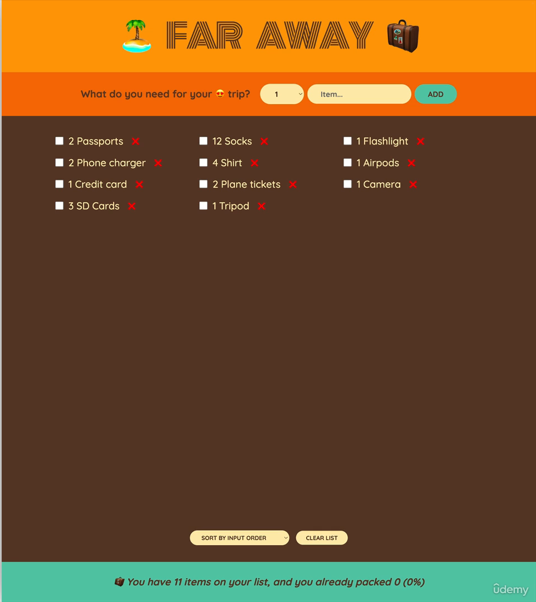
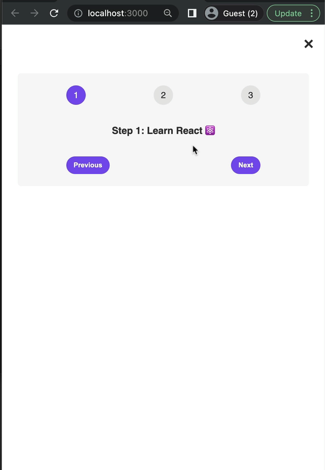

#### 56. [Section Overview](#56)

#### 57. [Let's Build a Steps Component](#57)

#### 58. [Handling Events the React Way](#58)

#### 59. [What is State in React?](#59)

#### 60. [Creating a State Variable With useState](#60)

#### 61. [Don't Set State Manually!](#61)

#### 62. [The Mechanics of State](#62)

#### 63. [Adding Another Piece of State](#63)

#### 64. [React Developer Tools](#64)

#### 65. [Updating State Based on Current State](#65)

#### 66. [More Thoughts About State + State Guidelines](#66)

#### 67. [A Vanilla JavaScript Implementation](#67)

#### 68. [CHALLENGE #1: Date Counter (v1)](#68)

### 56. Section Overview<a id="56"></a>

> Layout



<br>

### 57. Let's Build a Steps Component<a id="57"></a>

> Layout



- run cmd to create react app

```sh
npx create-react-app steps
cd steps
npm start
```

- remove everything from src folder except App.js, index.js

- copy all files from starter folder and paste in src folder

- move vanilla.js from src folder to public folder

- In index.js cleansing

```js
import React from "react";
import ReactDOM from "react-dom/client";
import "./index.css";
import App from "./App";

const root = ReactDOM.createRoot(document.getElementById("root"));
root.render(
  <React.StrictMode>
    <App />
  </React.StrictMode>
);
```

---

- In App.js

```js
const messages = [
  "Learn React ⚛️",
  "Apply for jobs 💼",
  "Invest your new income 🤑",
];

export default function App() {
  const step = 1;

  return (
    <div className="steps">
      <div className="numbers">
        <div className={`${step >= 1 ? "active" : ""}`}>1</div>
        <div className={`${step >= 2 ? "active" : ""}`}>2</div>
        <div className={`${step >= 3 ? "active" : ""}`}>3</div>
      </div>

      <p className="message">
        Step {step}: {messages[step - 1]}
      </p>

      <div className="buttons">
        <button style={{ backgroundColor: "#7950f2", color: "#fff" }}>
          Previous
        </button>
        <button style={{ backgroundColor: "#7950f2", color: "#fff" }}>
          Next
        </button>
      </div>
    </div>
  );
}
```

<br>

### 58. Handling Events the React Way<a id="58"></a>

- In App.js create handle previous and next button event

```js
const messages = [
  "Learn React ⚛️",
  "Apply for jobs 💼",
  "Invest your new income 🤑",
];

export default function App() {
  const step = 1;

  // 2️⃣
  function handlePrevious() {
    alert("Previous");
  }

  // 4️⃣
  function handleNext() {
    alert("Next");
  }

  return (
    <div className="steps">
      <div className="numbers">
        <div className={`${step >= 1 ? "active" : ""}`}>1</div>
        <div className={`${step >= 2 ? "active" : ""}`}>2</div>
        <div className={`${step >= 3 ? "active" : ""}`}>3</div>
      </div>

      <p className="message">
        Step {step}: {messages[step - 1]}
      </p>

      <div className="buttons">
        {/* 1️⃣ */}
        <button
          style={{ backgroundColor: "#7950f2", color: "#fff" }}
          onClick={handlePrevious}
        >
          Previous
        </button>

        {/* 3️⃣ */}
        <button
          style={{ backgroundColor: "#7950f2", color: "#fff" }}
          onClick={handleNext}
        >
          Next
        </button>
      </div>
    </div>
  );
}
```

- click on button to test alert msg

<br>

### 59. What is State in React?<a id="59"></a>

- ref. slides

<br>

### 60. Creating a State Variable With useState<a id="60"></a>

- In src/App.js, add use state and setup using three step

  1. add a new piece of state variable with default value
  1. use the variable in JSX
  1. update the piece of state by using event handler

```js
import { useState } from "react";

const messages = [
  "Learn React ⚛️",
  "Apply for jobs 💼",
  "Invest your new income 🤑",
];

export default function App() {
  // 1️⃣
  const [step, setStep] = useState(1);

  // 3️⃣
  function handlePrevious() {
    if (step > 1) setStep(step - 1);
  }

  // 3️⃣
  function handleNext() {
    if (step < 3) setStep(step + 1);
  }

  // 2️⃣
  return (
    <div className="steps">
      <div className="numbers">
        <div className={step >= 1 ? "active" : ""}>1</div>
        <div className={step >= 2 ? "active" : ""}>2</div>
        <div className={step >= 3 ? "active" : ""}>3</div>
      </div>

      <p className="message">
        Step {step}: {messages[step - 1]}
      </p>

      <div className="buttons">
        <button
          style={{ backgroundColor: "#7950f2", color: "#fff" }}
          onClick={handlePrevious}
        >
          Previous
        </button>

        <button
          style={{ backgroundColor: "#7950f2", color: "#fff" }}
          onClick={handleNext}
        >
          Next
        </button>
      </div>
    </div>
  );
}
```

<br>

### 61. Don't Set State Manually!<a id="61"></a>

- Bad practice explain to update state

<br>

### 62. The Mechanics of State<a id="62"></a>

- ref. slides
- React react to state changes by re-rendering the UI

<br>

### 63. Adding Another Piece of State<a id="63"></a>

- In src/index.js, do conditional rendering to control show and hide feature by using new piece of state

```js
import { useState } from "react";

const messages = [
  "Learn React ⚛️",
  "Apply for jobs 💼",
  "Invest your new income 🤑",
];

export default function App() {
  const [step, setStep] = useState(1);
  // 1️⃣
  const [isOpen, setIsOpen] = useState(true);

  function handlePrevious() {
    if (step > 1) setStep(step - 1);
  }

  function handleNext() {
    if (step < 3) setStep(step + 1);
  }

  return (
    // 2️⃣ wrap inside react fragment
    <>
      {/* 4️⃣ update state */}
      <button className="close" onClick={() => setIsOpen(!isOpen)}>
        &times;
      </button>

      {/* 3️⃣ conditional rendering  */}
      {isOpen && (
        <div className="steps">
          <div className="numbers">
            <div className={step >= 1 ? "active" : ""}>1</div>
            <div className={step >= 2 ? "active" : ""}>2</div>
            <div className={step >= 3 ? "active" : ""}>3</div>
          </div>

          <p className="message">
            Step {step}: {messages[step - 1]}
          </p>

          <div className="buttons">
            <button
              style={{ backgroundColor: "#7950f2", color: "#fff" }}
              onClick={handlePrevious}
            >
              Previous
            </button>

            <button
              style={{ backgroundColor: "#7950f2", color: "#fff" }}
              onClick={handleNext}
            >
              Next
            </button>
          </div>
        </div>
      )}
    </>
  );
}
```

<br>

### 64. React Developer Tools<a id="64"></a>

- try

<br>

### 65. Updating State Based on Current State<a id="65"></a>

- In src/index.js, use callback to update state

```js
import { useState } from "react";

const messages = [
  "Learn React ⚛️",
  "Apply for jobs 💼",
  "Invest your new income 🤑",
];

export default function App() {
  const [step, setStep] = useState(1);
  const [isOpen, setIsOpen] = useState(true);

  function handlePrevious() {
    // 1️⃣
    if (step > 1) setStep((s) => s - 1);
  }

  function handleNext() {
    if (step < 3) {
      // 2️⃣
      setStep((s) => s + 1);
      // setStep((s) => s + 1);
    }

    // BAD PRACTICE
    // test.name = "Fred";
    // setTest({ name: "Fred" });
  }

  return (
    <>
      {/* 3️⃣ */}
      <button className="close" onClick={() => setIsOpen((is) => !is)}>
        &times;
      </button>

      {isOpen && (
        <div className="steps">
          <div className="numbers">
            <div className={step >= 1 ? "active" : ""}>1</div>
            <div className={step >= 2 ? "active" : ""}>2</div>
            <div className={step >= 3 ? "active" : ""}>3</div>
          </div>

          <p className="message">
            Step {step}: {messages[step - 1]}
          </p>

          <div className="buttons">
            <button
              style={{ backgroundColor: "#7950f2", color: "#fff" }}
              onClick={handlePrevious}
            >
              Previous
            </button>

            <button
              style={{ backgroundColor: "#7950f2", color: "#fff" }}
              onClick={handleNext}
            >
              Next
            </button>
          </div>
        </div>
      )}
    </>
  );
}
```

<br>

### 66. More Thoughts About State + State Guidelines<a id="66"></a>

- ref. slides

<br>

### 67. A Vanilla JavaScript Implementation<a id="67"></a>

<br>

### 68. CHALLENGE #1: Date Counter (v1)<a id="68"></a>

<br>
