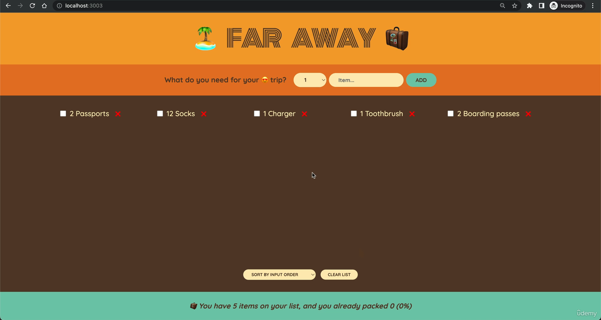
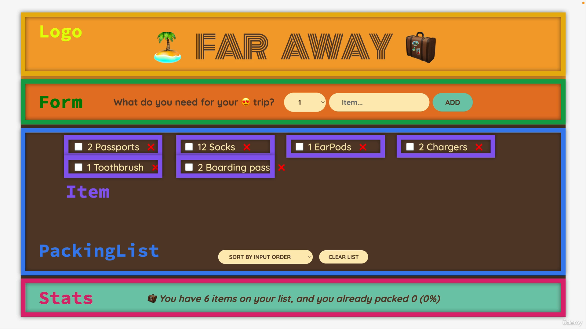

#### 69. [Starting a New Project: The "Far Away" Travel List](#69)

#### 70. [Building the Layout](#70)

#### 71. [Rendering the Items List](#71)

#### 72. [Building a Form and Handling Submissions](#72)

#### 73. [Controlled Elements](#73)

#### 74. [State vs. Props](#74)

#### 75. [EXERCISE #1: Flashcards](#75)

#### 76. [CHALLENGE #2: Date Counter (v2)](#76)

---

#### 77. [Section Overview](#77)

#### 78. [What is "Thinking in React"?](#78)

#### 79. [Fundamentals of State Management](#79)

#### 80. [Thinking About State and Lifting State Up](#80)

#### 81. [Reviewing "Lifting Up State"](#81)

#### 82. [Deleting an Item: More Child-to-Parent Communication!](#82)

#### 83. [Updating an Item: Complex Immutable Data Operation](#83)

#### 84. [Derived State](#84)

#### 85. [Calculating Statistics as Derived State](#85)

#### 86. [Sorting Items](#86)

#### 87. [Clearing the List](#87)

#### 88. [Moving Components Into Separate Files](#88)

#### 89. [EXERCISE #1: Accordion Component (v1)](#89)

#### 90. [The "children" Prop: Making a Reusable Button](#90)

#### 91. [More Reusability With the "children" Prop](#91)

#### 92. [EXERCISE #2: Accordion Component (v2)](#92)

#### 93. [CHALLENGE #1: Tip Calculator](#93)

---

<br>

### 69. Starting a New Project: The "Far Away" Travel List<a id="69"></a>

> Layout




<br>

> Breakdown



<br>

---

- run cmd to create react app

```sh
npx create-react-app travel-list
cd travel-list
npm start

```

### 70. Building the Layout<a id="70"></a>

- In src folder remove everything except App.js, index.js
- Move index.css from starter to src folder
- In index.js, cleansing

```js
import React from "react";
import ReactDOM from "react-dom/client";
import "./index.css";
import App from "./App";

const root = ReactDOM.createRoot(document.getElementById("root"));
root.render(
  <React.StrictMode>
    <App />
  </React.StrictMode>
);
```

---

- In src/App.js remove everything, write Layout section

```js
export default function App() {}

function Logo() {}

function Form() {}

function PackingList() {}

function Stats() {}
```

---

- In src/App.js, return JSX for testing

```js
export default function App() {}

function Logo() {
  return <h1>🏝️ Far Away 🧳</h1>;
}

function Form() {
  return (
    <div className="add-form">
      <h3>What do you need for your 😍 trip?</h3>
    </div>
  );
}

function PackingList() {
  return <div className="list">LIST</div>;
}

function Stats() {
  return (
    <footer>
      <em>💼 You have X items on your list, and you already packed X </em>
    </footer>
  );
}
```

---

- In src/App.js, include all four component in App

```js
export default function App() {
  return (
    <div className="app">
      <Logo />
      <Form />
      <PackingList />
      <Stats />
    </div>
  );
}

function Logo() {
  return <h1>🏝️ Far Away 🧳</h1>;
}

function Form() {
  return (
    <div className="add-form">
      <h3>What do you need for your 😍 trip?</h3>
    </div>
  );
}

function PackingList() {
  return <div className="list">LIST</div>;
}

function Stats() {
  return (
    <footer className="stats">
      <em>💼 You have X items on your list, and you already packed X </em>
    </footer>
  );
}
```

<br>

### 71. Rendering the Items List<a id="71"></a>

- Go to src/index.css, copy initialItems arry and paste to src/App.js and uncomment

```js
// 1️⃣
const initialItems = [
  { id: 1, description: "Passports", quantity: 2, packed: false },
  { id: 2, description: "Socks", quantity: 12, packed: false },
];

export default function App() {
  return (
    <div className="app">
      <Logo />
      <Form />
      <PackingList />
      <Stats />
    </div>
  );
}

function Logo() {
  return <h1>🏝️ Far Away 🧳</h1>;
}

function Form() {
  return (
    <div className="add-form">
      <h3>What do you need for your 😍 trip?</h3>
    </div>
  );
}

function PackingList() {
  return <div className="list">LIST</div>;
}

function Stats() {
  return (
    <footer className="stats">
      <em>💼 You have X items on your list, and you already packed X </em>
    </footer>
  );
}
```

---

- In src/App.js, render list by creating new Item component

```js
const initialItems = [
  { id: 1, description: "Passports", quantity: 2, packed: false },
  { id: 2, description: "Socks", quantity: 12, packed: false },
];

export default function App() {
  return (
    <div className="app">
      <Logo />
      <Form />
      <PackingList />
      <Stats />
    </div>
  );
}

function Logo() {
  return <h1>🏝️ Far Away 🧳</h1>;
}

function Form() {
  return (
    <div className="add-form">
      <h3>What do you need for your 😍 trip?</h3>
    </div>
  );
}

function PackingList() {
  // 1️⃣
  return (
    <div className="list">
      <ul>
        {initialItems.map((item) => (
          <Item item={item} />
        ))}
      </ul>
    </div>
  );
}

// 2️⃣
function Item({ item }) {
  return (
    <li>
      <span style={item.packed ? { textDecoration: "line-through" } : {}}>
        {item.quantity} {item.description}
      </span>
      <button>❌</button>
    </li>
  );
}

function Stats() {
  return (
    <footer className="stats">
      <em>💼 You have X items on your list, and you already packed X </em>
    </footer>
  );
}
```

<br>

### 72. Building a Form and Handling Submissions<a id="72"></a>

- In src/App.js, creating form ,also fix PackingList component key

```js
const initialItems = [
  { id: 1, description: "Passports", quantity: 2, packed: false },
  { id: 2, description: "Socks", quantity: 12, packed: false },
];

export default function App() {
  return (
    <div className="app">
      <Logo />
      <Form />
      <PackingList />
      <Stats />
    </div>
  );
}

function Logo() {
  return <h1>🏝️ Far Away 🧳</h1>;
}

// 1️⃣
function Form() {
  function handleSubmit(e) {
    e.preventDefault();
  }

  return (
    <form className="add-form" onSubmit={handleSubmit}>
      <h3>What do you need for your 😍 trip?</h3>

      <select>
        {Array.from({ length: 20 }, (_, i) => i + 1).map((num) => (
          <option value={num} key={num}>
            {num}
          </option>
        ))}
      </select>

      <input type="text" placeholder="Item..." />

      <button>Add</button>
    </form>
  );
}

function PackingList() {
  return (
    <div className="list">
      <ul>
        {initialItems.map((item) => (
          {/* 2️⃣ add key  */}
          <Item item={item} key={item.id} />
        ))}
      </ul>
    </div>
  );
}

function Item({ item }) {
  return (
    <li>
      <span style={item.packed ? { textDecoration: "line-through" } : {}}>
        {item.quantity} {item.description}
      </span>
      <button>❌</button>
    </li>
  );
}

function Stats() {
  return (
    <footer className="stats">
      <em>💼 You have X items on your list, and you already packed X </em>
    </footer>
  );
}
```

<br>

### 73. Controlled Elements<a id="73"></a>

- The technique of controlled element consist of three steps

1. Define a piece of state
1. use that piece of state variable on the element that u want to control
1. update that satate variable using onChange handler

- In src/App.js, setup two new state to control input element
  - In submit handler create new item

```js
import { useState } from "react";

const initialItems = [
  { id: 1, description: "Passports", quantity: 2, packed: false },
  { id: 2, description: "Socks", quantity: 12, packed: false },
];

export default function App() {
  return (
    <div className="app">
      <Logo />
      <Form />
      <PackingList />
      <Stats />
    </div>
  );
}

function Logo() {
  return <h1>🏝️ Far Away 🧳</h1>;
}

function Form() {
  // 1️⃣
  const [description, setDescription] = useState("");
  const [quantity, setQuantity] = useState(1);

  function handleSubmit(e) {
    e.preventDefault();

    // 4️⃣ feature to add new item
    if (!description) return;

    const newItem = { description, quantity, packed: false, id: Date.now() };

    // reset form
    setDescription("");
    setQuantity(1);
  }

  return (
    <form className="add-form" onSubmit={handleSubmit}>
      <h3>What do you need for your 😍 trip?</h3>

      {/* 2️⃣ */}
      <select
        value={quantity}
        onChange={(e) => setQuantity(Number(e.target.value))}
      >
        {Array.from({ length: 20 }, (_, i) => i + 1).map((num) => (
          <option value={num} key={num}>
            {num}
          </option>
        ))}
      </select>

      {/* 3️⃣ */}
      <input
        type="text"
        placeholder="Item..."
        value={description}
        onChange={(e) => setDescription(e.target.value)}
      />

      <button>Add</button>
    </form>
  );
}

function PackingList() {
  return (
    <div className="list">
      <ul>
        {initialItems.map((item) => (
          <Item item={item} key={item.id} />
        ))}
      </ul>
    </div>
  );
}

function Item({ item }) {
  return (
    <li>
      <span style={item.packed ? { textDecoration: "line-through" } : {}}>
        {item.quantity} {item.description}
      </span>
      <button>❌</button>
    </li>
  );
}

function Stats() {
  return (
    <footer className="stats">
      <em>💼 You have X items on your list, and you already packed X </em>
    </footer>
  );
}
```

<br>

---

### 77. Section Overview<a id="77"></a>

<br>

### 78. What is "Thinking in React"?<a id="78"></a>

- ref slides

<br>

### 79. Fundamentals of State Management<a id="79"></a>

- ref slides

<br>

### 80. Thinking About State and Lifting State Up<a id="80"></a>

- whenever multiple sibling components need access to same state, we move that piece of state up,to the first common parent component, in our case is the App.js

- In src/App.js,

```js
import { useState } from "react";

const initialItems = [
  { id: 1, description: "Passports", quantity: 2, packed: false },
  { id: 2, description: "Socks", quantity: 12, packed: false },
];

export default function App() {
  // 1️⃣
  const [items, setItems] = useState([]);

  // 2️⃣
  function handleAddItems(item) {
    setItems((items) => [...items, item]);
  }

  return (
    <div className="app">
      <Logo />
      {/* 3️⃣ pass update state func*/}
      <Form onAddItems={handleAddItems} />

      {/* 6️⃣ pass state variable*/}
      <PackingList items={items} />
      <Stats />
    </div>
  );
}

function Logo() {
  return <h1>🏝️ Far Away 🧳</h1>;
}

// 4️⃣ destructure
function Form({ onAddItems }) {
  const [description, setDescription] = useState("");
  const [quantity, setQuantity] = useState(1);

  function handleSubmit(e) {
    e.preventDefault();

    if (!description) return;

    const newItem = { description, quantity, packed: false, id: Date.now() };

    // 5️⃣ update item list by adding new item
    onAddItems(newItem);

    setDescription("");
    setQuantity(1);
  }

  return (
    <form className="add-form" onSubmit={handleSubmit}>
      <h3>What do you need for your 😍 trip?</h3>

      <select
        value={quantity}
        onChange={(e) => setQuantity(Number(e.target.value))}
      >
        {Array.from({ length: 20 }, (_, i) => i + 1).map((num) => (
          <option value={num} key={num}>
            {num}
          </option>
        ))}
      </select>

      <input
        type="text"
        placeholder="Item..."
        value={description}
        onChange={(e) => setDescription(e.target.value)}
      />

      <button>Add</button>
    </form>
  );
}

// 7️⃣ destructure
function PackingList({ items }) {
  return (
    <div className="list">
      <ul>
        {/* 8️⃣ iterating over item list*/}
        {items.map((item) => (
          <Item item={item} key={item.id} />
        ))}
      </ul>
    </div>
  );
}

function Item({ item }) {
  return (
    <li>
      <span style={item.packed ? { textDecoration: "line-through" } : {}}>
        {item.quantity} {item.description}
      </span>
      <button>❌</button>
    </li>
  );
}

function Stats() {
  return (
    <footer className="stats">
      <em>💼 You have X items on your list, and you already packed X </em>
    </footer>
  );
}
```

<br>

### 81. Reviewing "Lifting Up State"<a id="81"></a>

- ref slides

<br>

### 82. Deleting an Item: More Child-to-Parent Communication!<a id="82"></a>

- In src/App.js, setup delete item function and pass down to have, children-parent communication
  - comment dummy item array

```js
import { useState } from "react";
// 8️⃣ comment old arrray
// const initialItems = [
//   { id: 1, description: "Passports", quantity: 2, packed: false },
//   { id: 2, description: "Socks", quantity: 12, packed: false },
// ];

export default function App() {

// 7️⃣ initalize initialItem as default instead of empty array
  // const [items, setItems] = useState(initialItems);
  const [items, setItems] = useState([]);

  function handleAddItems(item) {
    setItems((items) => [...items, item]);
  }

  // 1️⃣ delete item update state
  function handleDeleteItem(id) {
    // filter out the matching id and give new one without it
    setItems((items) => items.filter((item) => item.id !== id));
  }

  return (
    <div className="app">
      <Logo />
      <Form onAddItems={handleAddItems} />
      {/* 2️⃣ passing down handleDeleteItem*/}
      <PackingList items={items} onDeleteItem={handleDeleteItem} />
      <Stats />
    </div>
  );
}

function Logo() {
  return <h1>🏝️ Far Away 🧳</h1>;
}

function Form({ onAddItems }) {
  const [description, setDescription] = useState("");
  const [quantity, setQuantity] = useState(1);

  function handleSubmit(e) {
    e.preventDefault();

    if (!description) return;

    const newItem = { description, quantity, packed: false, id: Date.now() };

    onAddItems(newItem);

    setDescription("");
    setQuantity(1);
  }

  return (
    <form className="add-form" onSubmit={handleSubmit}>
      <h3>What do you need for your 😍 trip?</h3>

      <select
        value={quantity}
        onChange={(e) => setQuantity(Number(e.target.value))}
      >
        {Array.from({ length: 20 }, (_, i) => i + 1).map((num) => (
          <option value={num} key={num}>
            {num}
          </option>
        ))}
      </select>

      <input
        type="text"
        placeholder="Item..."
        value={description}
        onChange={(e) => setDescription(e.target.value)}
      />

      <button>Add</button>
    </form>
  );
}

// 3️⃣ destructure
function PackingList({ items, onDeleteItem }) {
  return (
    <div className="list">
      <ul>
        {items.map((item) => (
              {/* 4️⃣ pass down onDeleteItem update fun*/}
          <Item item={item} onDeleteItem={onDeleteItem} key={item.id} />
        ))}
      </ul>
    </div>
  );
}

// 5️⃣ destructure
function Item({ item, onDeleteItem }) {
  return (
    <li>
      <span style={item.packed ? { textDecoration: "line-through" } : {}}>
        {item.quantity} {item.description}
      </span>
          {/* 6️⃣ update state*/}
      <button onClick={() => onDeleteItem(item.id)}>❌</button>
    </li>
  );
}

function Stats() {
  return (
    <footer className="stats">
      <em>💼 You have X items on your list, and you already packed X </em>
    </footer>
  );
}
```

<br>

### 83. Updating an Item: Complex Immutable Data Operation<a id="83"></a>

- In src/App.js, create new checkbox element in Item component, make it controlled element

```js
import { useState } from "react";

// const initialItems = [
//   { id: 1, description: "Passports", quantity: 2, packed: false },
//   { id: 2, description: "Socks", quantity: 12, packed: false },
// ];

export default function App() {
  // initalize initialItem as default
  // const [items, setItems] = useState(initialItems);
  const [items, setItems] = useState([]);

  function handleAddItems(item) {
    setItems((items) => [...items, item]);
  }

  function handleDeleteItem(id) {
    setItems((items) => items.filter((item) => item.id !== id));
  }

  // 2️⃣ function to update state
  function handleToggleItem(id) {
    setItems((items) =>
      items.map((item) =>
        item.id === id ? { ...item, packed: !item.packed } : item
      )
    );
  }

  return (
    <div className="app">
      <Logo />
      <Form onAddItems={handleAddItems} />

      <PackingList
        items={items}
        onDeleteItem={handleDeleteItem}
        {/* 3️⃣ pass function down*/}
        onToggleItem={handleToggleItem}
      />
      <Stats />
    </div>
  );
}

function Logo() {
  return <h1>🏝️ Far Away 🧳</h1>;
}

function Form({ onAddItems }) {
  const [description, setDescription] = useState("");
  const [quantity, setQuantity] = useState(1);

  function handleSubmit(e) {
    e.preventDefault();

    if (!description) return;

    const newItem = { description, quantity, packed: false, id: Date.now() };

    onAddItems(newItem);

    setDescription("");
    setQuantity(1);
  }

  return (
    <form className="add-form" onSubmit={handleSubmit}>
      <h3>What do you need for your 😍 trip?</h3>

      <select
        value={quantity}
        onChange={(e) => setQuantity(Number(e.target.value))}
      >
        {Array.from({ length: 20 }, (_, i) => i + 1).map((num) => (
          <option value={num} key={num}>
            {num}
          </option>
        ))}
      </select>

      <input
        type="text"
        placeholder="Item..."
        value={description}
        onChange={(e) => setDescription(e.target.value)}
      />

      <button>Add</button>
    </form>
  );
}

// 4️⃣ destructuring
function PackingList({ items, onDeleteItem, onToggleItem }) {
  return (
    <div className="list">
      <ul>
        {items.map((item) => (
          <Item
            item={item}
            onDeleteItem={onDeleteItem}
            {/* 5️⃣ pass function down*/}
            onToggleItem={onToggleItem}
            key={item.id}
          />
        ))}
      </ul>
    </div>
  );
}

// 6️⃣ destructure
function Item({ item, onDeleteItem, onToggleItem }) {
  return (
    <li>
      {/* 1️⃣  create new checkbox element and make it controlled element*/}
      <input
        type="checkbox"
        value={item.packed}
        {/* 7️⃣ callback update state*/}
        onChange={() => onToggleItem(item.id)}
      />

      <span style={item.packed ? { textDecoration: "line-through" } : {}}>
        {item.quantity} {item.description}
      </span>
      <button onClick={() => onDeleteItem(item.id)}>❌</button>
    </li>
  );
}

function Stats() {
  return (
    <footer className="stats">
      <em>💼 You have X items on your list, and you already packed X </em>
    </footer>
  );
}
```

<br>

### 84. Derived State<a id="84"></a>

- ref slides

<br>

### 85. Calculating Statistics as Derived State<a id="85"></a>

- In src/App.js,

```js
import { useState } from "react";

// const initialItems = [
//   { id: 1, description: "Passports", quantity: 2, packed: false },
//   { id: 2, description: "Socks", quantity: 12, packed: false },
// ];

export default function App() {
  // initalize initialItem as default
  // const [items, setItems] = useState(initialItems);
  const [items, setItems] = useState([]);

  function handleAddItems(item) {
    setItems((items) => [...items, item]);
  }

  function handleDeleteItem(id) {
    setItems((items) => items.filter((item) => item.id !== id));
  }

  function handleToggleItem(id) {
    setItems((items) =>
      items.map((item) =>
        item.id === id ? { ...item, packed: !item.packed } : item
      )
    );
  }

  return (
    <div className="app">
      <Logo />
      <Form onAddItems={handleAddItems} />
      <PackingList
        items={items}
        onDeleteItem={handleDeleteItem}
        onToggleItem={handleToggleItem}
      />
      {/* 1️⃣ pass state variable for derived state */}
      <Stats items={items} />
    </div>
  );
}

function Logo() {
  return <h1>🏝️ Far Away 🧳</h1>;
}

function Form({ onAddItems }) {
  const [description, setDescription] = useState("");
  const [quantity, setQuantity] = useState(1);

  function handleSubmit(e) {
    e.preventDefault();

    if (!description) return;

    const newItem = { description, quantity, packed: false, id: Date.now() };

    onAddItems(newItem);

    setDescription("");
    setQuantity(1);
  }

  return (
    <form className="add-form" onSubmit={handleSubmit}>
      <h3>What do you need for your 😍 trip?</h3>

      <select
        value={quantity}
        onChange={(e) => setQuantity(Number(e.target.value))}
      >
        {Array.from({ length: 20 }, (_, i) => i + 1).map((num) => (
          <option value={num} key={num}>
            {num}
          </option>
        ))}
      </select>

      <input
        type="text"
        placeholder="Item..."
        value={description}
        onChange={(e) => setDescription(e.target.value)}
      />

      <button>Add</button>
    </form>
  );
}

function PackingList({ items, onDeleteItem, onToggleItem }) {
  return (
    <div className="list">
      <ul>
        {items.map((item) => (
          <Item
            item={item}
            onDeleteItem={onDeleteItem}
            onToggleItem={onToggleItem}
            key={item.id}
          />
        ))}
      </ul>
    </div>
  );
}

function Item({ item, onDeleteItem, onToggleItem }) {
  return (
    <li>
      <input
        type="checkbox"
        value={item.packed}
        onChange={() => onToggleItem(item.id)}
      />

      <span style={item.packed ? { textDecoration: "line-through" } : {}}>
        {item.quantity} {item.description}
      </span>
      <button onClick={() => onDeleteItem(item.id)}>❌</button>
    </li>
  );
}

// 2️⃣ destructure
function Stats({ items }) {
  // 3️⃣ logic to check list length
  if (!items.length)
    return (
      <p className="stats">
        <em>Start adding some items to your packing list 🚀</em>
      </p>
    );

  // 4️⃣calculte stats by math
  const numItems = items.length;
  const numPacked = items.filter((item) => item.packed).length;
  const percentage = Math.round((numPacked / numItems) * 100);

  return (
    <footer className="stats">
      {/* 5️⃣ conditional rendering */}
      <em>
        {percentage === 100
          ? "You got everything! Ready to go ✈️"
          : ` 💼 You have ${numItems} items on your list, and you already packed ${numPacked} (${percentage}%)`}
      </em>
    </footer>
  );
}
```

<br>

### 86. Sorting Items<a id="86"></a>

- In src/App.js, create new input type select element and make it controlled element, create sort feature

```js
import { useState } from "react";

// const initialItems = [
//   { id: 1, description: "Passports", quantity: 2, packed: false },
//   { id: 2, description: "Socks", quantity: 12, packed: false },
// ];

export default function App() {
  // initalize initialItem as default
  // const [items, setItems] = useState(initialItems);
  const [items, setItems] = useState([]);

  function handleAddItems(item) {
    setItems((items) => [...items, item]);
  }

  function handleDeleteItem(id) {
    setItems((items) => items.filter((item) => item.id !== id));
  }

  function handleToggleItem(id) {
    setItems((items) =>
      items.map((item) =>
        item.id === id ? { ...item, packed: !item.packed } : item
      )
    );
  }

  return (
    <div className="app">
      <Logo />
      <Form onAddItems={handleAddItems} />
      <PackingList
        items={items}
        onDeleteItem={handleDeleteItem}
        onToggleItem={handleToggleItem}
      />
      <Stats items={items} />
    </div>
  );
}

function Logo() {
  return <h1>🏝️ Far Away 🧳</h1>;
}

function Form({ onAddItems }) {
  const [description, setDescription] = useState("");
  const [quantity, setQuantity] = useState(1);

  function handleSubmit(e) {
    e.preventDefault();

    if (!description) return;

    const newItem = { description, quantity, packed: false, id: Date.now() };

    onAddItems(newItem);

    setDescription("");
    setQuantity(1);
  }

  return (
    <form className="add-form" onSubmit={handleSubmit}>
      <h3>What do you need for your 😍 trip?</h3>

      <select
        value={quantity}
        onChange={(e) => setQuantity(Number(e.target.value))}
      >
        {Array.from({ length: 20 }, (_, i) => i + 1).map((num) => (
          <option value={num} key={num}>
            {num}
          </option>
        ))}
      </select>

      <input
        type="text"
        placeholder="Item..."
        value={description}
        onChange={(e) => setDescription(e.target.value)}
      />

      <button>Add</button>
    </form>
  );
}

function PackingList({ items, onDeleteItem, onToggleItem }) {
  const [sortBy, setSortBy] = useState("input");

  // 2️⃣ new array variable
  let sortedItems;

  // 3️⃣ sort type feature
  if (sortBy === "input") sortedItems = items;

  if (sortBy === "description")
    sortedItems = items
      .slice()
      .sort((a, b) => a.description.localeCompare(b.description));

  if (sortBy === "packed")
    sortedItems = items
      .slice()
      .sort((a, b) => Number(a.packed) - Number(b.packed));

  return (
    <div className="list">
      <ul>
        {/* 4️⃣ running map function on new array */}
        {sortedItems.map((item) => (
          <Item
            item={item}
            onDeleteItem={onDeleteItem}
            onToggleItem={onToggleItem}
            key={item.id}
          />
        ))}
      </ul>

      {/* 1️⃣ select type input*/}
      <div className="actions">
        <select value={sortBy} onChange={(e) => setSortBy(e.target.value)}>
          <option value="input">Sort by input order</option>
          <option value="description">Sort by description</option>
          <option value="packed">Sort by packed status</option>
        </select>
      </div>
    </div>
  );
}

function Item({ item, onDeleteItem, onToggleItem }) {
  return (
    <li>
      <input
        type="checkbox"
        value={item.packed}
        onChange={() => onToggleItem(item.id)}
      />

      <span style={item.packed ? { textDecoration: "line-through" } : {}}>
        {item.quantity} {item.description}
      </span>
      <button onClick={() => onDeleteItem(item.id)}>❌</button>
    </li>
  );
}

function Stats({ items }) {
  if (!items.length)
    return (
      <p className="stats">
        <em>Start adding some items to your packing list 🚀</em>
      </p>
    );

  const numItems = items.length;
  const numPacked = items.filter((item) => item.packed).length;
  const percentage = Math.round((numPacked / numItems) * 100);

  return (
    <footer className="stats">
      <em>
        {percentage === 100
          ? "You got everything! Ready to go ✈️"
          : ` 💼 You have ${numItems} items on your list, and you already packed ${numPacked} (${percentage}%)`}
      </em>
    </footer>
  );
}
```

<br>

### 87. Clearing the List<a id="87"></a>

- In src/App.js, createing clearall feature

```js
import { useState } from "react";

// const initialItems = [
//   { id: 1, description: "Passports", quantity: 2, packed: false },
//   { id: 2, description: "Socks", quantity: 12, packed: false },
// ];

export default function App() {
  // initalize initialItem as default
  // const [items, setItems] = useState(initialItems);
  const [items, setItems] = useState([]);

  function handleAddItems(item) {
    setItems((items) => [...items, item]);
  }

  function handleDeleteItem(id) {
    setItems((items) => items.filter((item) => item.id !== id));
  }

  function handleToggleItem(id) {
    setItems((items) =>
      items.map((item) =>
        item.id === id ? { ...item, packed: !item.packed } : item
      )
    );
  }

  // 2️⃣ clear all item state update
  function handleClearList() {
    const confirmed = window.confirm(
      "Are you sure you want to delete all items?"
    );

    if (confirmed) setItems([]);
  }

  return (
    <div className="app">
      <Logo />
      <Form onAddItems={handleAddItems} />
      <PackingList
        items={items}
        onDeleteItem={handleDeleteItem}
        onToggleItem={handleToggleItem}
           {/* 3️⃣ pass down clearList funtion */}
        onClearList={handleClearList}
      />
      <Stats items={items} />
    </div>
  );
}

function Logo() {
  return <h1>🏝️ Far Away 🧳</h1>;
}

function Form({ onAddItems }) {
  const [description, setDescription] = useState("");
  const [quantity, setQuantity] = useState(1);

  function handleSubmit(e) {
    e.preventDefault();

    if (!description) return;

    const newItem = { description, quantity, packed: false, id: Date.now() };

    onAddItems(newItem);

    setDescription("");
    setQuantity(1);
  }

  return (
    <form className="add-form" onSubmit={handleSubmit}>
      <h3>What do you need for your 😍 trip?</h3>

      <select
        value={quantity}
        onChange={(e) => setQuantity(Number(e.target.value))}
      >
        {Array.from({ length: 20 }, (_, i) => i + 1).map((num) => (
          <option value={num} key={num}>
            {num}
          </option>
        ))}
      </select>

      <input
        type="text"
        placeholder="Item..."
        value={description}
        onChange={(e) => setDescription(e.target.value)}
      />

      <button>Add</button>
    </form>
  );
}

function PackingList({ items, onDeleteItem, onToggleItem, onClearList }) {
  const [sortBy, setSortBy] = useState("input");

  let sortedItems;

  if (sortBy === "input") sortedItems = items;

  if (sortBy === "description")
    sortedItems = items
      .slice()
      .sort((a, b) => a.description.localeCompare(b.description));

  if (sortBy === "packed")
    sortedItems = items
      .slice()
      .sort((a, b) => Number(a.packed) - Number(b.packed));

  return (
    <div className="list">
      <ul>
        {sortedItems.map((item) => (
          <Item
            item={item}
            onDeleteItem={onDeleteItem}
            onToggleItem={onToggleItem}
            key={item.id}
          />
        ))}
      </ul>

      <div className="actions">
        <select value={sortBy} onChange={(e) => setSortBy(e.target.value)}>
          <option value="input">Sort by input order</option>
          <option value="description">Sort by description</option>
          <option value="packed">Sort by packed status</option>
        </select>

        {/* 1️⃣ button element setup */}
        <button onClick={onClearList}>Clear list</button>
      </div>
    </div>
  );
}

function Item({ item, onDeleteItem, onToggleItem }) {
  return (
    <li>
      <input
        type="checkbox"
        value={item.packed}
        onChange={() => onToggleItem(item.id)}
      />

      <span style={item.packed ? { textDecoration: "line-through" } : {}}>
        {item.quantity} {item.description}
      </span>
      <button onClick={() => onDeleteItem(item.id)}>❌</button>
    </li>
  );
}

function Stats({ items }) {
  if (!items.length)
    return (
      <p className="stats">
        <em>Start adding some items to your packing list 🚀</em>
      </p>
    );

  const numItems = items.length;
  const numPacked = items.filter((item) => item.packed).length;
  const percentage = Math.round((numPacked / numItems) * 100);

  return (
    <footer className="stats">
      <em>
        {percentage === 100
          ? "You got everything! Ready to go ✈️"
          : ` 💼 You have ${numItems} items on your list, and you already packed ${numPacked} (${percentage}%)`}
      </em>
    </footer>
  );
}
```

<br>

### 88. Moving Components Into Separate Files<a id="88"></a>

- In src folder create Logo.js file, move code from App.js to here

```js
export default function Logo() {
  return <h1>🏝️ Far Away 🧳</h1>;
}
```

- import Logo to App.js

---

- In src folder create Form.js file, move code from App.js to here

```js
import { useState } from "react";

export default function Form({ onAddItems }) {
  const [description, setDescription] = useState("");
  const [quantity, setQuantity] = useState(1);

  function handleSubmit(e) {
    e.preventDefault();

    if (!description) return;

    const newItem = { description, quantity, packed: false, id: Date.now() };

    onAddItems(newItem);

    setDescription("");
    setQuantity(1);
  }

  return (
    <form className="add-form" onSubmit={handleSubmit}>
      <h3>What do you need for your 😍 trip?</h3>
      <select
        value={quantity}
        onChange={(e) => setQuantity(Number(e.target.value))}
      >
        {Array.from({ length: 20 }, (_, i) => i + 1).map((num) => (
          <option value={num} key={num}>
            {num}
          </option>
        ))}
      </select>
      <input
        type="text"
        placeholder="Item..."
        value={description}
        onChange={(e) => setDescription(e.target.value)}
      />
      <button>Add</button>
    </form>
  );
}
```

- import Form to App.js

---

- In src folder create PackingList.js file, move code from App.js to here automatically

```js
import { useState } from "react";
import Item from "./Item";

export default function PackingList({
  items,
  onDeleteItem,
  onToggleItem,
  onClearList,
}) {
  const [sortBy, setSortBy] = useState("input");

  let sortedItems;

  if (sortBy === "input") sortedItems = items;

  if (sortBy === "description")
    sortedItems = items
      .slice()
      .sort((a, b) => a.description.localeCompare(b.description));

  if (sortBy === "packed")
    sortedItems = items
      .slice()
      .sort((a, b) => Number(a.packed) - Number(b.packed));

  return (
    <div className="list">
      <ul>
        {sortedItems.map((item) => (
          <Item
            item={item}
            onDeleteItem={onDeleteItem}
            onToggleItem={onToggleItem}
            key={item.id}
          />
        ))}
      </ul>

      <div className="actions">
        <select value={sortBy} onChange={(e) => setSortBy(e.target.value)}>
          <option value="input">Sort by input order</option>
          <option value="description">Sort by description</option>
          <option value="packed">Sort by packed status</option>
        </select>
        <button onClick={onClearList}>Clear list</button>
      </div>
    </div>
  );
}
```

- import PackingList to App.js

---

- In src folder create Item.js file, move code from App.js to here automatically

```js
export default function Item({ item, onDeleteItem, onToggleItem }) {
  return (
    <li>
      <input
        type="checkbox"
        value={item.packed}
        onChange={() => onToggleItem(item.id)}
      />
      <span style={item.packed ? { textDecoration: "line-through" } : {}}>
        {item.quantity} {item.description}
      </span>
      <button onClick={() => onDeleteItem(item.id)}>❌</button>
    </li>
  );
}
```

- import Item to PackingList.js

---

- In src folder create Stats.js file, move code from App.js to here

```js
export default function Stats({ items }) {
  if (!items.length)
    return (
      <p className="stats">
        <em>Start adding some items to your packing list 🚀</em>
      </p>
    );

  const numItems = items.length;
  const numPacked = items.filter((item) => item.packed).length;
  const percentage = Math.round((numPacked / numItems) * 100);

  return (
    <footer className="stats">
      <em>
        {percentage === 100
          ? "You got everything! Ready to go ✈️"
          : ` 💼 You have ${numItems} items on your list, and you already packed ${numPacked} (${percentage}%)`}
      </em>
    </footer>
  );
}
```

- import Stats to App.js

---

- In src folder create new components-subfolder and move App, Form, Item, Logo, PackingList, Stats component there
- In src/index.js fix App component path

```js
import React from "react";
import ReactDOM from "react-dom/client";
import "./index.css";
// 1️⃣
import App from "./components/App";

const root = ReactDOM.createRoot(document.getElementById("root"));
root.render(
  <React.StrictMode>
    <App />
  </React.StrictMode>
);
```

---

- In src/index.css, remove scrollbar

```js
/*
const initialItems = [
  { id: 1, description: "Passports", quantity: 2, packed: false },
  { id: 2, description: "Socks", quantity: 12, packed: false },
];
*/

@import url("https://fonts.googleapis.com/css2?family=Monoton&family=Quicksand:wght@500;700&display=swap");

* {
  margin: 0;
  padding: 0;
  box-sizing: border-box;
}

html {
  font-size: 62.5%;
}

body {
  font-size: 2.4rem;
  font-family: sans-serif;
  color: #5a3e2b;
  font-family: "Quicksand";
  font-weight: 500;
}

.app {
  width: 100%;
  height: 100vh;
  display: grid;
  grid-template-rows: auto auto 1fr auto;
}

h1 {
  text-align: center;
  background-color: #f4a226;
  font-family: "Monoton";
  font-size: 8rem;
  text-transform: uppercase;
  font-weight: 400;
  word-spacing: 30px;
  letter-spacing: -5px;
  padding: 2.4rem 0;
}

.add-form {
  background-color: #e5771f;
  padding: 2.8rem 0;
  display: flex;
  align-items: center;
  justify-content: center;
  gap: 0.8rem;
}

h3 {
  margin-right: 1.6rem;
  font-size: 2.4rem;
}

button,
select,
input {
  background-color: #ffebb3;
  color: #5a3e2b;
  font-family: inherit;
  border: none;
  border-radius: 10rem;
  padding: 1.2rem 3.2rem;
  font-weight: 700;
  font-size: 1.8rem;
  cursor: pointer;
}

.add-form button {
  text-transform: uppercase;
  background-color: #76c7ad;
}

.list {
  background-color: #5a3e2b;
  color: #ffebb3;
  padding: 4rem 0;

  display: flex;
  justify-content: space-between;
  flex-direction: column;
  gap: 3.2rem;
  align-items: center;
}

.actions button,
.list select {
  text-transform: uppercase;
  padding: 0.8rem 2.4rem;
  font-size: 1.4rem;
  font-weight: 700;
  margin: 0 0.8rem;
}

.list ul {
  list-style: none;
  width: 80%;
  overflow: scroll;

  display: grid;
  grid-template-columns: repeat(auto-fit, minmax(250px, 1fr));
  gap: 1.2rem;
  justify-content: center;
  align-content: start;
}

/* 1️⃣ remove scrollbar */
.list ul::-webkit-scrollbar {
  display: none;
}

.list li {
  display: flex;
  align-items: center;
  gap: 1.2rem;
}

input[type="checkbox"] {
  height: 2rem;
  width: 2rem;
  accent-color: #e5771f;
}

.list li button {
  cursor: pointer;
  background: none;
  border: none;
  font-size: 1.8rem;
  padding: 0.8rem;
  transform: translateY(2px);
}

.stats {
  background-color: #76c7ad;
  text-align: center;
  font-weight: 700;
  padding: 3.2rem 0;
}

```

<br>

### 89. EXERCISE #1: Accordion Component (v1)<a id="89"></a>

<br>

### 90. The "children" Prop: Making a Reusable Button<a id="90"></a>

<br>

### 91. More Reusability With the "children" Prop<a id="91"></a>

<br>

### 92. EXERCISE #2: Accordion Component (v2)<a id="92"></a>

<br>

### 93. CHALLENGE #1: Tip Calculator<a id="93"></a>

<br>

---

### 74. State vs. Props<a id="74"></a>

<br>

### 75. EXERCISE #1: Flashcards<a id="75"></a>

<br>

### 76. CHALLENGE #2: Date Counter (v2)<a id="76"></a>

<br>
