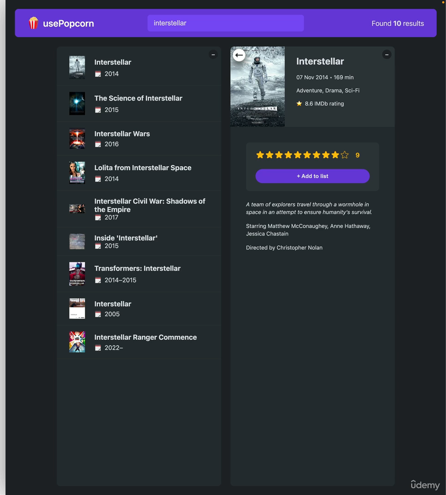

#### 105. [Section Overview](#105)

#### 106. [Setting Up the "usePopcorn" Project](#106)

#### 107. [How to Split a UI Into Components](#107)

#### 108. [Splitting Components in Practice](#108)

#### 109. [Component Categories](#109)

#### 110. [Prop Drilling](#110)

#### 111. [Component Composition](#111)

#### 112. [Fixing Prop Drilling With Composition (And Building a Layout)](#112)

#### 113. [Using Composition to Make a Reusable Box](#113)

#### 114. [Passing Elements as Props (Alternative to children)](#114)

#### 115. [Building a Reusable Star Rating Component](#115)

#### 116. [Creating the Stars](#116)

#### 117. [Handling Hover Events](#117)

#### 118. [Props as a Component API](#118)

#### 119. [Improving Reusability With Props](#119)

#### 120. [PropTypes](#120)

#### 121. [CHALLENGE #1: Text Expander Component](#121)

---

<br>

### 105. Section Overview<a id="105"></a>



<br>

### 106. Setting Up the "usePopcorn" Project<a id="106"></a>

- run cmd to create react app

```sh
npx create-react-app usepopcorn
cd usepopcorn
npm start
```

<br>

### 107. How to Split a UI Into Components<a id="107"></a>

- ref slides

<br>

### 108. Splitting Components in Practice<a id="108"></a>

- from starter folder copy all and replace in src folder
- also remove all files except, App.js, index.css, index.js
- In src/index.js clean up

```js
import React from "react";
import ReactDOM from "react-dom/client";
import "./index.css";
import App from "./App";

const root = ReactDOM.createRoot(document.getElementById("root"));
root.render(
  <React.StrictMode>
    <App />
  </React.StrictMode>
);
```

---

> In src/App.js splliting component -Logical seperation

```js
import { useState } from "react";

const tempMovieData = [
  {
    imdbID: "tt1375666",
    Title: "Inception",
    Year: "2010",
    Poster:
      "https://m.media-amazon.com/images/M/MV5BMjAxMzY3NjcxNF5BMl5BanBnXkFtZTcwNTI5OTM0Mw@@._V1_SX300.jpg",
  },
  {
    imdbID: "tt0133093",
    Title: "The Matrix",
    Year: "1999",
    Poster:
      "https://m.media-amazon.com/images/M/MV5BNzQzOTk3OTAtNDQ0Zi00ZTVkLWI0MTEtMDllZjNkYzNjNTc4L2ltYWdlXkEyXkFqcGdeQXVyNjU0OTQ0OTY@._V1_SX300.jpg",
  },
  {
    imdbID: "tt6751668",
    Title: "Parasite",
    Year: "2019",
    Poster:
      "https://m.media-amazon.com/images/M/MV5BYWZjMjk3ZTItODQ2ZC00NTY5LWE0ZDYtZTI3MjcwN2Q5NTVkXkEyXkFqcGdeQXVyODk4OTc3MTY@._V1_SX300.jpg",
  },
];

const tempWatchedData = [
  {
    imdbID: "tt1375666",
    Title: "Inception",
    Year: "2010",
    Poster:
      "https://m.media-amazon.com/images/M/MV5BMjAxMzY3NjcxNF5BMl5BanBnXkFtZTcwNTI5OTM0Mw@@._V1_SX300.jpg",
    runtime: 148,
    imdbRating: 8.8,
    userRating: 10,
  },
  {
    imdbID: "tt0088763",
    Title: "Back to the Future",
    Year: "1985",
    Poster:
      "https://m.media-amazon.com/images/M/MV5BZmU0M2Y1OGUtZjIxNi00ZjBkLTg1MjgtOWIyNThiZWIwYjRiXkEyXkFqcGdeQXVyMTQxNzMzNDI@._V1_SX300.jpg",
    runtime: 116,
    imdbRating: 8.5,
    userRating: 9,
  },
];

const average = (arr) =>
  arr.reduce((acc, cur, i, arr) => acc + cur / arr.length, 0);

export default function App() {
  const [query, setQuery] = useState("");
  const [movies, setMovies] = useState(tempMovieData);
  const [watched, setWatched] = useState(tempWatchedData);
  const [isOpen1, setIsOpen1] = useState(true);
  const [isOpen2, setIsOpen2] = useState(true);

  const avgImdbRating = average(watched.map((movie) => movie.imdbRating));
  const avgUserRating = average(watched.map((movie) => movie.userRating));
  const avgRuntime = average(watched.map((movie) => movie.runtime));

  return (
    <>
      <nav className="nav-bar">
        <div className="logo">
          <span role="img">🍿</span>
          <h1>usePopcorn</h1>
        </div>
        <input
          className="search"
          type="text"
          placeholder="Search movies..."
          value={query}
          onChange={(e) => setQuery(e.target.value)}
        />
        <p className="num-results">
          Found <strong>{movies.length}</strong> results
        </p>
      </nav>

      <main className="main">
        <div className="box">
          <button
            className="btn-toggle"
            onClick={() => setIsOpen1((open) => !open)}
          >
            {isOpen1 ? "–" : "+"}
          </button>
          {isOpen1 && (
            <ul className="list">
              {movies?.map((movie) => (
                <li key={movie.imdbID}>
                  
                  <h3>{movie.Title}</h3>
                  <div>
                    <p>
                      <span>🗓</span>
                      <span>{movie.Year}</span>
                    </p>
                  </div>
                </li>
              ))}
            </ul>
          )}
        </div>

        <div className="box">
          <button
            className="btn-toggle"
            onClick={() => setIsOpen2((open) => !open)}
          >
            {isOpen2 ? "–" : "+"}
          </button>
          {isOpen2 && (
            <>
              <div className="summary">
                <h2>Movies you watched</h2>
                <div>
                  <p>
                    <span>#️⃣</span>
                    <span>{watched.length} movies</span>
                  </p>
                  <p>
                    <span>⭐️</span>
                    <span>{avgImdbRating}</span>
                  </p>
                  <p>
                    <span>🌟</span>
                    <span>{avgUserRating}</span>
                  </p>
                  <p>
                    <span>⏳</span>
                    <span>{avgRuntime} min</span>
                  </p>
                </div>
              </div>

              <ul className="list">
                {watched.map((movie) => (
                  <li key={movie.imdbID}>
                    
                    <h3>{movie.Title}</h3>
                    <div>
                      <p>
                        <span>⭐️</span>
                        <span>{movie.imdbRating}</span>
                      </p>
                      <p>
                        <span>🌟</span>
                        <span>{movie.userRating}</span>
                      </p>
                      <p>
                        <span>⏳</span>
                        <span>{movie.runtime} min</span>
                      </p>
                    </div>
                  </li>
                ))}
              </ul>
            </>
          )}
        </div>
      </main>
    </>
  );
}
```

---

- In src?app.js split NavBar

```js
import { useState } from "react";

const tempMovieData = [
  {
    imdbID: "tt1375666",
    Title: "Inception",
    Year: "2010",
    Poster:
      "https://m.media-amazon.com/images/M/MV5BMjAxMzY3NjcxNF5BMl5BanBnXkFtZTcwNTI5OTM0Mw@@._V1_SX300.jpg",
  },
  {
    imdbID: "tt0133093",
    Title: "The Matrix",
    Year: "1999",
    Poster:
      "https://m.media-amazon.com/images/M/MV5BNzQzOTk3OTAtNDQ0Zi00ZTVkLWI0MTEtMDllZjNkYzNjNTc4L2ltYWdlXkEyXkFqcGdeQXVyNjU0OTQ0OTY@._V1_SX300.jpg",
  },
  {
    imdbID: "tt6751668",
    Title: "Parasite",
    Year: "2019",
    Poster:
      "https://m.media-amazon.com/images/M/MV5BYWZjMjk3ZTItODQ2ZC00NTY5LWE0ZDYtZTI3MjcwN2Q5NTVkXkEyXkFqcGdeQXVyODk4OTc3MTY@._V1_SX300.jpg",
  },
];

const tempWatchedData = [
  {
    imdbID: "tt1375666",
    Title: "Inception",
    Year: "2010",
    Poster:
      "https://m.media-amazon.com/images/M/MV5BMjAxMzY3NjcxNF5BMl5BanBnXkFtZTcwNTI5OTM0Mw@@._V1_SX300.jpg",
    runtime: 148,
    imdbRating: 8.8,
    userRating: 10,
  },
  {
    imdbID: "tt0088763",
    Title: "Back to the Future",
    Year: "1985",
    Poster:
      "https://m.media-amazon.com/images/M/MV5BZmU0M2Y1OGUtZjIxNi00ZjBkLTg1MjgtOWIyNThiZWIwYjRiXkEyXkFqcGdeQXVyMTQxNzMzNDI@._V1_SX300.jpg",
    runtime: 116,
    imdbRating: 8.5,
    userRating: 9,
  },
];

const average = (arr) =>
  arr.reduce((acc, cur, i, arr) => acc + cur / arr.length, 0);

// 1️⃣
function NavBar() {
  // 2️⃣ bring state
  const [query, setQuery] = useState("");

  return (
    <nav className="nav-bar">
      <div className="logo">
        <span role="img">🍿</span>
        <h1>usePopcorn</h1>
      </div>
      <input
        className="search"
        type="text"
        placeholder="Search movies..."
        value={query}
        onChange={(e) => setQuery(e.target.value)}
      />
      <p className="num-results">
        {/* 3️⃣ replce movie props with X */}
        Found <strong>X</strong> results
      </p>
    </nav>
  );
}

export default function App() {
  const [movies, setMovies] = useState(tempMovieData);
  const [watched, setWatched] = useState(tempWatchedData);
  const [isOpen1, setIsOpen1] = useState(true);
  const [isOpen2, setIsOpen2] = useState(true);

  const avgImdbRating = average(watched.map((movie) => movie.imdbRating));
  const avgUserRating = average(watched.map((movie) => movie.userRating));
  const avgRuntime = average(watched.map((movie) => movie.runtime));

  return (
    <>
      {/* 4️⃣ component */}
      <NavBar />

      <main className="main">
        <div className="box">
          <button
            className="btn-toggle"
            onClick={() => setIsOpen1((open) => !open)}
          >
            {isOpen1 ? "–" : "+"}
          </button>
          {isOpen1 && (
            <ul className="list">
              {movies?.map((movie) => (
                <li key={movie.imdbID}>
                  
                  <h3>{movie.Title}</h3>
                  <div>
                    <p>
                      <span>🗓</span>
                      <span>{movie.Year}</span>
                    </p>
                  </div>
                </li>
              ))}
            </ul>
          )}
        </div>

        <div className="box">
          <button
            className="btn-toggle"
            onClick={() => setIsOpen2((open) => !open)}
          >
            {isOpen2 ? "–" : "+"}
          </button>
          {isOpen2 && (
            <>
              <div className="summary">
                <h2>Movies you watched</h2>
                <div>
                  <p>
                    <span>#️⃣</span>
                    <span>{watched.length} movies</span>
                  </p>
                  <p>
                    <span>⭐️</span>
                    <span>{avgImdbRating}</span>
                  </p>
                  <p>
                    <span>🌟</span>
                    <span>{avgUserRating}</span>
                  </p>
                  <p>
                    <span>⏳</span>
                    <span>{avgRuntime} min</span>
                  </p>
                </div>
              </div>

              <ul className="list">
                {watched.map((movie) => (
                  <li key={movie.imdbID}>
                    
                    <h3>{movie.Title}</h3>
                    <div>
                      <p>
                        <span>⭐️</span>
                        <span>{movie.imdbRating}</span>
                      </p>
                      <p>
                        <span>🌟</span>
                        <span>{movie.userRating}</span>
                      </p>
                      <p>
                        <span>⏳</span>
                        <span>{movie.runtime} min</span>
                      </p>
                    </div>
                  </li>
                ))}
              </ul>
            </>
          )}
        </div>
      </main>
    </>
  );
}
```

---

- In src/App.js, split Main

```js
import { useState } from "react";

const tempMovieData = [
  {
    imdbID: "tt1375666",
    Title: "Inception",
    Year: "2010",
    Poster:
      "https://m.media-amazon.com/images/M/MV5BMjAxMzY3NjcxNF5BMl5BanBnXkFtZTcwNTI5OTM0Mw@@._V1_SX300.jpg",
  },
  {
    imdbID: "tt0133093",
    Title: "The Matrix",
    Year: "1999",
    Poster:
      "https://m.media-amazon.com/images/M/MV5BNzQzOTk3OTAtNDQ0Zi00ZTVkLWI0MTEtMDllZjNkYzNjNTc4L2ltYWdlXkEyXkFqcGdeQXVyNjU0OTQ0OTY@._V1_SX300.jpg",
  },
  {
    imdbID: "tt6751668",
    Title: "Parasite",
    Year: "2019",
    Poster:
      "https://m.media-amazon.com/images/M/MV5BYWZjMjk3ZTItODQ2ZC00NTY5LWE0ZDYtZTI3MjcwN2Q5NTVkXkEyXkFqcGdeQXVyODk4OTc3MTY@._V1_SX300.jpg",
  },
];

const tempWatchedData = [
  {
    imdbID: "tt1375666",
    Title: "Inception",
    Year: "2010",
    Poster:
      "https://m.media-amazon.com/images/M/MV5BMjAxMzY3NjcxNF5BMl5BanBnXkFtZTcwNTI5OTM0Mw@@._V1_SX300.jpg",
    runtime: 148,
    imdbRating: 8.8,
    userRating: 10,
  },
  {
    imdbID: "tt0088763",
    Title: "Back to the Future",
    Year: "1985",
    Poster:
      "https://m.media-amazon.com/images/M/MV5BZmU0M2Y1OGUtZjIxNi00ZjBkLTg1MjgtOWIyNThiZWIwYjRiXkEyXkFqcGdeQXVyMTQxNzMzNDI@._V1_SX300.jpg",
    runtime: 116,
    imdbRating: 8.5,
    userRating: 9,
  },
];

const average = (arr) =>
  arr.reduce((acc, cur, i, arr) => acc + cur / arr.length, 0);

export default function App() {
  return (
    <>
      <NavBar />
      <Main />
    </>
  );
}

function NavBar() {
  const [query, setQuery] = useState("");

  return (
    <nav className="nav-bar">
      <div className="logo">
        <span role="img">🍿</span>
        <h1>usePopcorn</h1>
      </div>
      <input
        className="search"
        type="text"
        placeholder="Search movies..."
        value={query}
        onChange={(e) => setQuery(e.target.value)}
      />
      <p className="num-results">
        Found <strong>X</strong> results
      </p>
    </nav>
  );
}

// 1️⃣ split Manin function
function Main() {
  // 2️⃣ bring state
  const [movies, setMovies] = useState(tempMovieData);
  const [watched, setWatched] = useState(tempWatchedData);
  const [isOpen1, setIsOpen1] = useState(true);
  const [isOpen2, setIsOpen2] = useState(true);

  const avgImdbRating = average(watched.map((movie) => movie.imdbRating));
  const avgUserRating = average(watched.map((movie) => movie.userRating));
  const avgRuntime = average(watched.map((movie) => movie.runtime));

  return (
    <main className="main">
      <div className="box">
        <button
          className="btn-toggle"
          onClick={() => setIsOpen1((open) => !open)}
        >
          {isOpen1 ? "–" : "+"}
        </button>
        {isOpen1 && (
          <ul className="list">
            {movies?.map((movie) => (
              <li key={movie.imdbID}>
                
                <h3>{movie.Title}</h3>
                <div>
                  <p>
                    <span>🗓</span>
                    <span>{movie.Year}</span>
                  </p>
                </div>
              </li>
            ))}
          </ul>
        )}
      </div>

      <div className="box">
        <button
          className="btn-toggle"
          onClick={() => setIsOpen2((open) => !open)}
        >
          {isOpen2 ? "–" : "+"}
        </button>
        {isOpen2 && (
          <>
            <div className="summary">
              <h2>Movies you watched</h2>
              <div>
                <p>
                  <span>#️⃣</span>
                  <span>{watched.length} movies</span>
                </p>
                <p>
                  <span>⭐️</span>
                  <span>{avgImdbRating}</span>
                </p>
                <p>
                  <span>🌟</span>
                  <span>{avgUserRating}</span>
                </p>
                <p>
                  <span>⏳</span>
                  <span>{avgRuntime} min</span>
                </p>
              </div>
            </div>

            <ul className="list">
              {watched.map((movie) => (
                <li key={movie.imdbID}>
                  
                  <h3>{movie.Title}</h3>
                  <div>
                    <p>
                      <span>⭐️</span>
                      <span>{movie.imdbRating}</span>
                    </p>
                    <p>
                      <span>🌟</span>
                      <span>{movie.userRating}</span>
                    </p>
                    <p>
                      <span>⏳</span>
                      <span>{movie.runtime} min</span>
                    </p>
                  </div>
                </li>
              ))}
            </ul>
          </>
        )}
      </div>
    </main>
  );
}
```

---

- In src/App.js, split Search from NavBar component

```js
import { useState } from "react";

const tempMovieData = [
  {
    imdbID: "tt1375666",
    Title: "Inception",
    Year: "2010",
    Poster:
      "https://m.media-amazon.com/images/M/MV5BMjAxMzY3NjcxNF5BMl5BanBnXkFtZTcwNTI5OTM0Mw@@._V1_SX300.jpg",
  },
  {
    imdbID: "tt0133093",
    Title: "The Matrix",
    Year: "1999",
    Poster:
      "https://m.media-amazon.com/images/M/MV5BNzQzOTk3OTAtNDQ0Zi00ZTVkLWI0MTEtMDllZjNkYzNjNTc4L2ltYWdlXkEyXkFqcGdeQXVyNjU0OTQ0OTY@._V1_SX300.jpg",
  },
  {
    imdbID: "tt6751668",
    Title: "Parasite",
    Year: "2019",
    Poster:
      "https://m.media-amazon.com/images/M/MV5BYWZjMjk3ZTItODQ2ZC00NTY5LWE0ZDYtZTI3MjcwN2Q5NTVkXkEyXkFqcGdeQXVyODk4OTc3MTY@._V1_SX300.jpg",
  },
];

const tempWatchedData = [
  {
    imdbID: "tt1375666",
    Title: "Inception",
    Year: "2010",
    Poster:
      "https://m.media-amazon.com/images/M/MV5BMjAxMzY3NjcxNF5BMl5BanBnXkFtZTcwNTI5OTM0Mw@@._V1_SX300.jpg",
    runtime: 148,
    imdbRating: 8.8,
    userRating: 10,
  },
  {
    imdbID: "tt0088763",
    Title: "Back to the Future",
    Year: "1985",
    Poster:
      "https://m.media-amazon.com/images/M/MV5BZmU0M2Y1OGUtZjIxNi00ZjBkLTg1MjgtOWIyNThiZWIwYjRiXkEyXkFqcGdeQXVyMTQxNzMzNDI@._V1_SX300.jpg",
    runtime: 116,
    imdbRating: 8.5,
    userRating: 9,
  },
];

const average = (arr) =>
  arr.reduce((acc, cur, i, arr) => acc + cur / arr.length, 0);

export default function App() {
  return (
    <>
      <NavBar />
      <Main />
    </>
  );
}

function NavBar() {
  return (
    <nav className="nav-bar">
      <div className="logo">
        <span role="img">🍿</span>
        <h1>usePopcorn</h1>
      </div>

      {/* 3️⃣ Component*/}
      <Search />

      <p className="num-results">
        Found <strong>X</strong> results
      </p>
    </nav>
  );
}

// 1️⃣ Search split
function Search() {
  // 2️⃣ bring state
  const [query, setQuery] = useState("");
  return (
    <input
      className="search"
      type="text"
      placeholder="Search movies..."
      value={query}
      onChange={(e) => setQuery(e.target.value)}
    />
  );
}

function Main() {
  const [movies, setMovies] = useState(tempMovieData);
  const [watched, setWatched] = useState(tempWatchedData);
  const [isOpen1, setIsOpen1] = useState(true);
  const [isOpen2, setIsOpen2] = useState(true);

  const avgImdbRating = average(watched.map((movie) => movie.imdbRating));
  const avgUserRating = average(watched.map((movie) => movie.userRating));
  const avgRuntime = average(watched.map((movie) => movie.runtime));

  return (
    <main className="main">
      <div className="box">
        <button
          className="btn-toggle"
          onClick={() => setIsOpen1((open) => !open)}
        >
          {isOpen1 ? "–" : "+"}
        </button>
        {isOpen1 && (
          <ul className="list">
            {movies?.map((movie) => (
              <li key={movie.imdbID}>
                
                <h3>{movie.Title}</h3>
                <div>
                  <p>
                    <span>🗓</span>
                    <span>{movie.Year}</span>
                  </p>
                </div>
              </li>
            ))}
          </ul>
        )}
      </div>

      <div className="box">
        <button
          className="btn-toggle"
          onClick={() => setIsOpen2((open) => !open)}
        >
          {isOpen2 ? "–" : "+"}
        </button>
        {isOpen2 && (
          <>
            <div className="summary">
              <h2>Movies you watched</h2>
              <div>
                <p>
                  <span>#️⃣</span>
                  <span>{watched.length} movies</span>
                </p>
                <p>
                  <span>⭐️</span>
                  <span>{avgImdbRating}</span>
                </p>
                <p>
                  <span>🌟</span>
                  <span>{avgUserRating}</span>
                </p>
                <p>
                  <span>⏳</span>
                  <span>{avgRuntime} min</span>
                </p>
              </div>
            </div>

            <ul className="list">
              {watched.map((movie) => (
                <li key={movie.imdbID}>
                  
                  <h3>{movie.Title}</h3>
                  <div>
                    <p>
                      <span>⭐️</span>
                      <span>{movie.imdbRating}</span>
                    </p>
                    <p>
                      <span>🌟</span>
                      <span>{movie.userRating}</span>
                    </p>
                    <p>
                      <span>⏳</span>
                      <span>{movie.runtime} min</span>
                    </p>
                  </div>
                </li>
              ))}
            </ul>
          </>
        )}
      </div>
    </main>
  );
}
```

---

- In src/App.js, split Logo, NumResults from NavBar

```js
import { useState } from "react";

const tempMovieData = [
  {
    imdbID: "tt1375666",
    Title: "Inception",
    Year: "2010",
    Poster:
      "https://m.media-amazon.com/images/M/MV5BMjAxMzY3NjcxNF5BMl5BanBnXkFtZTcwNTI5OTM0Mw@@._V1_SX300.jpg",
  },
  {
    imdbID: "tt0133093",
    Title: "The Matrix",
    Year: "1999",
    Poster:
      "https://m.media-amazon.com/images/M/MV5BNzQzOTk3OTAtNDQ0Zi00ZTVkLWI0MTEtMDllZjNkYzNjNTc4L2ltYWdlXkEyXkFqcGdeQXVyNjU0OTQ0OTY@._V1_SX300.jpg",
  },
  {
    imdbID: "tt6751668",
    Title: "Parasite",
    Year: "2019",
    Poster:
      "https://m.media-amazon.com/images/M/MV5BYWZjMjk3ZTItODQ2ZC00NTY5LWE0ZDYtZTI3MjcwN2Q5NTVkXkEyXkFqcGdeQXVyODk4OTc3MTY@._V1_SX300.jpg",
  },
];

const tempWatchedData = [
  {
    imdbID: "tt1375666",
    Title: "Inception",
    Year: "2010",
    Poster:
      "https://m.media-amazon.com/images/M/MV5BMjAxMzY3NjcxNF5BMl5BanBnXkFtZTcwNTI5OTM0Mw@@._V1_SX300.jpg",
    runtime: 148,
    imdbRating: 8.8,
    userRating: 10,
  },
  {
    imdbID: "tt0088763",
    Title: "Back to the Future",
    Year: "1985",
    Poster:
      "https://m.media-amazon.com/images/M/MV5BZmU0M2Y1OGUtZjIxNi00ZjBkLTg1MjgtOWIyNThiZWIwYjRiXkEyXkFqcGdeQXVyMTQxNzMzNDI@._V1_SX300.jpg",
    runtime: 116,
    imdbRating: 8.5,
    userRating: 9,
  },
];

const average = (arr) =>
  arr.reduce((acc, cur, i, arr) => acc + cur / arr.length, 0);

export default function App() {
  return (
    <>
      <NavBar />
      <Main />
    </>
  );
}

function NavBar() {
  return (
    <nav className="nav-bar">
      {/* 3️⃣ */}
      <Logo />
      <Search />
      {/* 4️⃣  */}
      <NumResults />
    </nav>
  );
}

// 1️⃣
function Logo() {
  return (
    <div className="logo">
      <span role="img">🍿</span>
      <h1>usePopcorn</h1>
    </div>
  );
}

function Search() {
  const [query, setQuery] = useState("");
  return (
    <input
      className="search"
      type="text"
      placeholder="Search movies..."
      value={query}
      onChange={(e) => setQuery(e.target.value)}
    />
  );
}

// 2️⃣
function NumResults() {
  return (
    <p className="num-results">
      Found <strong>X</strong> results
    </p>
  );
}

function Main() {
  const [movies, setMovies] = useState(tempMovieData);
  const [watched, setWatched] = useState(tempWatchedData);
  const [isOpen1, setIsOpen1] = useState(true);
  const [isOpen2, setIsOpen2] = useState(true);

  const avgImdbRating = average(watched.map((movie) => movie.imdbRating));
  const avgUserRating = average(watched.map((movie) => movie.userRating));
  const avgRuntime = average(watched.map((movie) => movie.runtime));

  return (
    <main className="main">
      <div className="box">
        <button
          className="btn-toggle"
          onClick={() => setIsOpen1((open) => !open)}
        >
          {isOpen1 ? "–" : "+"}
        </button>
        {isOpen1 && (
          <ul className="list">
            {movies?.map((movie) => (
              <li key={movie.imdbID}>
                
                <h3>{movie.Title}</h3>
                <div>
                  <p>
                    <span>🗓</span>
                    <span>{movie.Year}</span>
                  </p>
                </div>
              </li>
            ))}
          </ul>
        )}
      </div>

      <div className="box">
        <button
          className="btn-toggle"
          onClick={() => setIsOpen2((open) => !open)}
        >
          {isOpen2 ? "–" : "+"}
        </button>
        {isOpen2 && (
          <>
            <div className="summary">
              <h2>Movies you watched</h2>
              <div>
                <p>
                  <span>#️⃣</span>
                  <span>{watched.length} movies</span>
                </p>
                <p>
                  <span>⭐️</span>
                  <span>{avgImdbRating}</span>
                </p>
                <p>
                  <span>🌟</span>
                  <span>{avgUserRating}</span>
                </p>
                <p>
                  <span>⏳</span>
                  <span>{avgRuntime} min</span>
                </p>
              </div>
            </div>

            <ul className="list">
              {watched.map((movie) => (
                <li key={movie.imdbID}>
                  
                  <h3>{movie.Title}</h3>
                  <div>
                    <p>
                      <span>⭐️</span>
                      <span>{movie.imdbRating}</span>
                    </p>
                    <p>
                      <span>🌟</span>
                      <span>{movie.userRating}</span>
                    </p>
                    <p>
                      <span>⏳</span>
                      <span>{movie.runtime} min</span>
                    </p>
                  </div>
                </li>
              ))}
            </ul>
          </>
        )}
      </div>
    </main>
  );
}
```

---

- In src/App.js, split ListBox, WatchedBox from Main component

```js
import { useState } from "react";

const tempMovieData = [
  {
    imdbID: "tt1375666",
    Title: "Inception",
    Year: "2010",
    Poster:
      "https://m.media-amazon.com/images/M/MV5BMjAxMzY3NjcxNF5BMl5BanBnXkFtZTcwNTI5OTM0Mw@@._V1_SX300.jpg",
  },
  {
    imdbID: "tt0133093",
    Title: "The Matrix",
    Year: "1999",
    Poster:
      "https://m.media-amazon.com/images/M/MV5BNzQzOTk3OTAtNDQ0Zi00ZTVkLWI0MTEtMDllZjNkYzNjNTc4L2ltYWdlXkEyXkFqcGdeQXVyNjU0OTQ0OTY@._V1_SX300.jpg",
  },
  {
    imdbID: "tt6751668",
    Title: "Parasite",
    Year: "2019",
    Poster:
      "https://m.media-amazon.com/images/M/MV5BYWZjMjk3ZTItODQ2ZC00NTY5LWE0ZDYtZTI3MjcwN2Q5NTVkXkEyXkFqcGdeQXVyODk4OTc3MTY@._V1_SX300.jpg",
  },
];

const tempWatchedData = [
  {
    imdbID: "tt1375666",
    Title: "Inception",
    Year: "2010",
    Poster:
      "https://m.media-amazon.com/images/M/MV5BMjAxMzY3NjcxNF5BMl5BanBnXkFtZTcwNTI5OTM0Mw@@._V1_SX300.jpg",
    runtime: 148,
    imdbRating: 8.8,
    userRating: 10,
  },
  {
    imdbID: "tt0088763",
    Title: "Back to the Future",
    Year: "1985",
    Poster:
      "https://m.media-amazon.com/images/M/MV5BZmU0M2Y1OGUtZjIxNi00ZjBkLTg1MjgtOWIyNThiZWIwYjRiXkEyXkFqcGdeQXVyMTQxNzMzNDI@._V1_SX300.jpg",
    runtime: 116,
    imdbRating: 8.5,
    userRating: 9,
  },
];

const average = (arr) =>
  arr.reduce((acc, cur, i, arr) => acc + cur / arr.length, 0);

export default function App() {
  return (
    <>
      <NavBar />
      <Main />
    </>
  );
}

function NavBar() {
  return (
    <nav className="nav-bar">
      <Logo />
      <Search />
      <NumResults />
    </nav>
  );
}

function Logo() {
  return (
    <div className="logo">
      <span role="img">🍿</span>
      <h1>usePopcorn</h1>
    </div>
  );
}

function Search() {
  const [query, setQuery] = useState("");
  return (
    <input
      className="search"
      type="text"
      placeholder="Search movies..."
      value={query}
      onChange={(e) => setQuery(e.target.value)}
    />
  );
}

function NumResults() {
  return (
    <p className="num-results">
      Found <strong>X</strong> results
    </p>
  );
}

function Main() {
  return (
    <main className="main">
      {/* 3️⃣ */}
      <ListBox />
      {/* 6️⃣ */}
      <WatchedBox />
    </main>
  );
}

// 1️⃣
function ListBox() {
  //  2️⃣ bring state
  const [movies, setMovies] = useState(tempMovieData);
  const [isOpen1, setIsOpen1] = useState(true);

  return (
    <div className="box">
      <button
        className="btn-toggle"
        onClick={() => setIsOpen1((open) => !open)}
      >
        {isOpen1 ? "–" : "+"}
      </button>
      {isOpen1 && (
        <ul className="list">
          {movies?.map((movie) => (
            <li key={movie.imdbID}>
              
              <h3>{movie.Title}</h3>
              <div>
                <p>
                  <span>🗓</span>
                  <span>{movie.Year}</span>
                </p>
              </div>
            </li>
          ))}
        </ul>
      )}
    </div>
  );
}

// 4️⃣ split WatchedBox
function WatchedBox() {
  // 5️⃣ bring state
  const [watched, setWatched] = useState(tempWatchedData);
  const [isOpen2, setIsOpen2] = useState(true);

  const avgImdbRating = average(watched.map((movie) => movie.imdbRating));
  const avgUserRating = average(watched.map((movie) => movie.userRating));
  const avgRuntime = average(watched.map((movie) => movie.runtime));

  return (
    <div className="box">
      <button
        className="btn-toggle"
        onClick={() => setIsOpen2((open) => !open)}
      >
        {isOpen2 ? "–" : "+"}
      </button>
      {isOpen2 && (
        <>
          <div className="summary">
            <h2>Movies you watched</h2>
            <div>
              <p>
                <span>#️⃣</span>
                <span>{watched.length} movies</span>
              </p>
              <p>
                <span>⭐️</span>
                <span>{avgImdbRating}</span>
              </p>
              <p>
                <span>🌟</span>
                <span>{avgUserRating}</span>
              </p>
              <p>
                <span>⏳</span>
                <span>{avgRuntime} min</span>
              </p>
            </div>
          </div>

          <ul className="list">
            {watched.map((movie) => (
              <li key={movie.imdbID}>
                
                <h3>{movie.Title}</h3>
                <div>
                  <p>
                    <span>⭐️</span>
                    <span>{movie.imdbRating}</span>
                  </p>
                  <p>
                    <span>🌟</span>
                    <span>{movie.userRating}</span>
                  </p>
                  <p>
                    <span>⏳</span>
                    <span>{movie.runtime} min</span>
                  </p>
                </div>
              </li>
            ))}
          </ul>
        </>
      )}
    </div>
  );
}
```

---

- In src/App.js, extract MovieList from ListBox component

```js
import { useState } from "react";

const tempMovieData = [
  {
    imdbID: "tt1375666",
    Title: "Inception",
    Year: "2010",
    Poster:
      "https://m.media-amazon.com/images/M/MV5BMjAxMzY3NjcxNF5BMl5BanBnXkFtZTcwNTI5OTM0Mw@@._V1_SX300.jpg",
  },
  {
    imdbID: "tt0133093",
    Title: "The Matrix",
    Year: "1999",
    Poster:
      "https://m.media-amazon.com/images/M/MV5BNzQzOTk3OTAtNDQ0Zi00ZTVkLWI0MTEtMDllZjNkYzNjNTc4L2ltYWdlXkEyXkFqcGdeQXVyNjU0OTQ0OTY@._V1_SX300.jpg",
  },
  {
    imdbID: "tt6751668",
    Title: "Parasite",
    Year: "2019",
    Poster:
      "https://m.media-amazon.com/images/M/MV5BYWZjMjk3ZTItODQ2ZC00NTY5LWE0ZDYtZTI3MjcwN2Q5NTVkXkEyXkFqcGdeQXVyODk4OTc3MTY@._V1_SX300.jpg",
  },
];

const tempWatchedData = [
  {
    imdbID: "tt1375666",
    Title: "Inception",
    Year: "2010",
    Poster:
      "https://m.media-amazon.com/images/M/MV5BMjAxMzY3NjcxNF5BMl5BanBnXkFtZTcwNTI5OTM0Mw@@._V1_SX300.jpg",
    runtime: 148,
    imdbRating: 8.8,
    userRating: 10,
  },
  {
    imdbID: "tt0088763",
    Title: "Back to the Future",
    Year: "1985",
    Poster:
      "https://m.media-amazon.com/images/M/MV5BZmU0M2Y1OGUtZjIxNi00ZjBkLTg1MjgtOWIyNThiZWIwYjRiXkEyXkFqcGdeQXVyMTQxNzMzNDI@._V1_SX300.jpg",
    runtime: 116,
    imdbRating: 8.5,
    userRating: 9,
  },
];

const average = (arr) =>
  arr.reduce((acc, cur, i, arr) => acc + cur / arr.length, 0);

export default function App() {
  return (
    <>
      <NavBar />
      <Main />
    </>
  );
}

function NavBar() {
  return (
    <nav className="nav-bar">
      <Logo />
      <Search />
      <NumResults />
    </nav>
  );
}

function Logo() {
  return (
    <div className="logo">
      <span role="img">🍿</span>
      <h1>usePopcorn</h1>
    </div>
  );
}

function Search() {
  const [query, setQuery] = useState("");
  return (
    <input
      className="search"
      type="text"
      placeholder="Search movies..."
      value={query}
      onChange={(e) => setQuery(e.target.value)}
    />
  );
}

function NumResults() {
  return (
    <p className="num-results">
      Found <strong>X</strong> results
    </p>
  );
}

function Main() {
  return (
    <main className="main">
      <ListBox />
      <WatchedBox />
    </main>
  );
}

function ListBox() {
  const [isOpen1, setIsOpen1] = useState(true);

  return (
    <div className="box">
      <button
        className="btn-toggle"
        onClick={() => setIsOpen1((open) => !open)}
      >
        {isOpen1 ? "–" : "+"}
      </button>
      {/* 3️⃣ component */}
      {isOpen1 && <MovieList />}
    </div>
  );
}

// 1️⃣
function MovieList() {
  // 2️⃣ bring state
  const [movies, setMovies] = useState(tempMovieData);

  return (
    <ul className="list">
      {movies?.map((movie) => (
        <li key={movie.imdbID}>
          
          <h3>{movie.Title}</h3>
          <div>
            <p>
              <span>🗓</span>
              <span>{movie.Year}</span>
            </p>
          </div>
        </li>
      ))}
    </ul>
  );
}

function WatchedBox() {
  const [watched, setWatched] = useState(tempWatchedData);
  const [isOpen2, setIsOpen2] = useState(true);

  const avgImdbRating = average(watched.map((movie) => movie.imdbRating));
  const avgUserRating = average(watched.map((movie) => movie.userRating));
  const avgRuntime = average(watched.map((movie) => movie.runtime));

  return (
    <div className="box">
      <button
        className="btn-toggle"
        onClick={() => setIsOpen2((open) => !open)}
      >
        {isOpen2 ? "–" : "+"}
      </button>
      {isOpen2 && (
        <>
          <div className="summary">
            <h2>Movies you watched</h2>
            <div>
              <p>
                <span>#️⃣</span>
                <span>{watched.length} movies</span>
              </p>
              <p>
                <span>⭐️</span>
                <span>{avgImdbRating}</span>
              </p>
              <p>
                <span>🌟</span>
                <span>{avgUserRating}</span>
              </p>
              <p>
                <span>⏳</span>
                <span>{avgRuntime} min</span>
              </p>
            </div>
          </div>

          <ul className="list">
            {watched.map((movie) => (
              <li key={movie.imdbID}>
                
                <h3>{movie.Title}</h3>
                <div>
                  <p>
                    <span>⭐️</span>
                    <span>{movie.imdbRating}</span>
                  </p>
                  <p>
                    <span>🌟</span>
                    <span>{movie.userRating}</span>
                  </p>
                  <p>
                    <span>⏳</span>
                    <span>{movie.runtime} min</span>
                  </p>
                </div>
              </li>
            ))}
          </ul>
        </>
      )}
    </div>
  );
}
```

---

- In src/App.js, Split single Movie from MovieList component

```js
import { useState } from "react";

const tempMovieData = [
  {
    imdbID: "tt1375666",
    Title: "Inception",
    Year: "2010",
    Poster:
      "https://m.media-amazon.com/images/M/MV5BMjAxMzY3NjcxNF5BMl5BanBnXkFtZTcwNTI5OTM0Mw@@._V1_SX300.jpg",
  },
  {
    imdbID: "tt0133093",
    Title: "The Matrix",
    Year: "1999",
    Poster:
      "https://m.media-amazon.com/images/M/MV5BNzQzOTk3OTAtNDQ0Zi00ZTVkLWI0MTEtMDllZjNkYzNjNTc4L2ltYWdlXkEyXkFqcGdeQXVyNjU0OTQ0OTY@._V1_SX300.jpg",
  },
  {
    imdbID: "tt6751668",
    Title: "Parasite",
    Year: "2019",
    Poster:
      "https://m.media-amazon.com/images/M/MV5BYWZjMjk3ZTItODQ2ZC00NTY5LWE0ZDYtZTI3MjcwN2Q5NTVkXkEyXkFqcGdeQXVyODk4OTc3MTY@._V1_SX300.jpg",
  },
];

const tempWatchedData = [
  {
    imdbID: "tt1375666",
    Title: "Inception",
    Year: "2010",
    Poster:
      "https://m.media-amazon.com/images/M/MV5BMjAxMzY3NjcxNF5BMl5BanBnXkFtZTcwNTI5OTM0Mw@@._V1_SX300.jpg",
    runtime: 148,
    imdbRating: 8.8,
    userRating: 10,
  },
  {
    imdbID: "tt0088763",
    Title: "Back to the Future",
    Year: "1985",
    Poster:
      "https://m.media-amazon.com/images/M/MV5BZmU0M2Y1OGUtZjIxNi00ZjBkLTg1MjgtOWIyNThiZWIwYjRiXkEyXkFqcGdeQXVyMTQxNzMzNDI@._V1_SX300.jpg",
    runtime: 116,
    imdbRating: 8.5,
    userRating: 9,
  },
];

const average = (arr) =>
  arr.reduce((acc, cur, i, arr) => acc + cur / arr.length, 0);

export default function App() {
  return (
    <>
      <NavBar />
      <Main />
    </>
  );
}

function NavBar() {
  return (
    <nav className="nav-bar">
      <Logo />
      <Search />
      <NumResults />
    </nav>
  );
}

function Logo() {
  return (
    <div className="logo">
      <span role="img">🍿</span>
      <h1>usePopcorn</h1>
    </div>
  );
}

function Search() {
  const [query, setQuery] = useState("");
  return (
    <input
      className="search"
      type="text"
      placeholder="Search movies..."
      value={query}
      onChange={(e) => setQuery(e.target.value)}
    />
  );
}

function NumResults() {
  return (
    <p className="num-results">
      Found <strong>X</strong> results
    </p>
  );
}

function Main() {
  return (
    <main className="main">
      <ListBox />
      <WatchedBox />
    </main>
  );
}

function ListBox() {
  const [isOpen1, setIsOpen1] = useState(true);

  return (
    <div className="box">
      <button
        className="btn-toggle"
        onClick={() => setIsOpen1((open) => !open)}
      >
        {isOpen1 ? "–" : "+"}
      </button>
      {isOpen1 && <MovieList />}
    </div>
  );
}

function MovieList() {
  const [movies, setMovies] = useState(tempMovieData);

  return (
    <ul className="list">
      {movies?.map((movie) => (
                {/* 2️⃣ component, pass prop to single movie */}
        <Movie movie={movie} key={movie.imdbID} />
      ))}
    </ul>
  );
}

// 1️⃣
function Movie({ movie }) {
  return (
    <li>
      
      <h3>{movie.Title}</h3>
      <div>
        <p>
          <span>🗓</span>
          <span>{movie.Year}</span>
        </p>
      </div>
    </li>
  );
}

function WatchedBox() {
  const [watched, setWatched] = useState(tempWatchedData);
  const [isOpen2, setIsOpen2] = useState(true);

  const avgImdbRating = average(watched.map((movie) => movie.imdbRating));
  const avgUserRating = average(watched.map((movie) => movie.userRating));
  const avgRuntime = average(watched.map((movie) => movie.runtime));

  return (
    <div className="box">
      <button
        className="btn-toggle"
        onClick={() => setIsOpen2((open) => !open)}
      >
        {isOpen2 ? "–" : "+"}
      </button>
      {isOpen2 && (
        <>
          <div className="summary">
            <h2>Movies you watched</h2>
            <div>
              <p>
                <span>#️⃣</span>
                <span>{watched.length} movies</span>
              </p>
              <p>
                <span>⭐️</span>
                <span>{avgImdbRating}</span>
              </p>
              <p>
                <span>🌟</span>
                <span>{avgUserRating}</span>
              </p>
              <p>
                <span>⏳</span>
                <span>{avgRuntime} min</span>
              </p>
            </div>
          </div>

          <ul className="list">
            {watched.map((movie) => (
              <li key={movie.imdbID}>
                
                <h3>{movie.Title}</h3>
                <div>
                  <p>
                    <span>⭐️</span>
                    <span>{movie.imdbRating}</span>
                  </p>
                  <p>
                    <span>🌟</span>
                    <span>{movie.userRating}</span>
                  </p>
                  <p>
                    <span>⏳</span>
                    <span>{movie.runtime} min</span>
                  </p>
                </div>
              </li>
            ))}
          </ul>
        </>
      )}
    </div>
  );
}
```

---

- In src/App, split WatchedSummary from WatchedBox component

```js
import { useState } from "react";

const tempMovieData = [
  {
    imdbID: "tt1375666",
    Title: "Inception",
    Year: "2010",
    Poster:
      "https://m.media-amazon.com/images/M/MV5BMjAxMzY3NjcxNF5BMl5BanBnXkFtZTcwNTI5OTM0Mw@@._V1_SX300.jpg",
  },
  {
    imdbID: "tt0133093",
    Title: "The Matrix",
    Year: "1999",
    Poster:
      "https://m.media-amazon.com/images/M/MV5BNzQzOTk3OTAtNDQ0Zi00ZTVkLWI0MTEtMDllZjNkYzNjNTc4L2ltYWdlXkEyXkFqcGdeQXVyNjU0OTQ0OTY@._V1_SX300.jpg",
  },
  {
    imdbID: "tt6751668",
    Title: "Parasite",
    Year: "2019",
    Poster:
      "https://m.media-amazon.com/images/M/MV5BYWZjMjk3ZTItODQ2ZC00NTY5LWE0ZDYtZTI3MjcwN2Q5NTVkXkEyXkFqcGdeQXVyODk4OTc3MTY@._V1_SX300.jpg",
  },
];

const tempWatchedData = [
  {
    imdbID: "tt1375666",
    Title: "Inception",
    Year: "2010",
    Poster:
      "https://m.media-amazon.com/images/M/MV5BMjAxMzY3NjcxNF5BMl5BanBnXkFtZTcwNTI5OTM0Mw@@._V1_SX300.jpg",
    runtime: 148,
    imdbRating: 8.8,
    userRating: 10,
  },
  {
    imdbID: "tt0088763",
    Title: "Back to the Future",
    Year: "1985",
    Poster:
      "https://m.media-amazon.com/images/M/MV5BZmU0M2Y1OGUtZjIxNi00ZjBkLTg1MjgtOWIyNThiZWIwYjRiXkEyXkFqcGdeQXVyMTQxNzMzNDI@._V1_SX300.jpg",
    runtime: 116,
    imdbRating: 8.5,
    userRating: 9,
  },
];

const average = (arr) =>
  arr.reduce((acc, cur, i, arr) => acc + cur / arr.length, 0);

export default function App() {
  return (
    <>
      <NavBar />
      <Main />
    </>
  );
}

function NavBar() {
  return (
    <nav className="nav-bar">
      <Logo />
      <Search />
      <NumResults />
    </nav>
  );
}

function Logo() {
  return (
    <div className="logo">
      <span role="img">🍿</span>
      <h1>usePopcorn</h1>
    </div>
  );
}

function Search() {
  const [query, setQuery] = useState("");
  return (
    <input
      className="search"
      type="text"
      placeholder="Search movies..."
      value={query}
      onChange={(e) => setQuery(e.target.value)}
    />
  );
}

function NumResults() {
  return (
    <p className="num-results">
      Found <strong>X</strong> results
    </p>
  );
}

function Main() {
  return (
    <main className="main">
      <ListBox />
      <WatchedBox />
    </main>
  );
}

function ListBox() {
  const [isOpen1, setIsOpen1] = useState(true);

  return (
    <div className="box">
      <button
        className="btn-toggle"
        onClick={() => setIsOpen1((open) => !open)}
      >
        {isOpen1 ? "–" : "+"}
      </button>
      {isOpen1 && <MovieList />}
    </div>
  );
}

function MovieList() {
  const [movies, setMovies] = useState(tempMovieData);

  return (
    <ul className="list">
      {movies?.map((movie) => (
        <Movie movie={movie} key={movie.imdbID} />
      ))}
    </ul>
  );
}

function Movie({ movie }) {
  return (
    <li>
      
      <h3>{movie.Title}</h3>
      <div>
        <p>
          <span>🗓</span>
          <span>{movie.Year}</span>
        </p>
      </div>
    </li>
  );
}

function WatchedBox() {
  const [watched, setWatched] = useState(tempWatchedData);
  const [isOpen2, setIsOpen2] = useState(true);

  const avgImdbRating = average(watched.map((movie) => movie.imdbRating));
  const avgUserRating = average(watched.map((movie) => movie.userRating));
  const avgRuntime = average(watched.map((movie) => movie.runtime));

  return (
    <div className="box">
      <button
        className="btn-toggle"
        onClick={() => setIsOpen2((open) => !open)}
      >
        {isOpen2 ? "–" : "+"}
      </button>
      {isOpen2 && (
        <>
          {/* 3️⃣ component pass props */}
          <WatchedSummary watched={watched} />

          <ul className="list">
            {watched.map((movie) => (
              <li key={movie.imdbID}>
                
                <h3>{movie.Title}</h3>
                <div>
                  <p>
                    <span>⭐️</span>
                    <span>{movie.imdbRating}</span>
                  </p>
                  <p>
                    <span>🌟</span>
                    <span>{movie.userRating}</span>
                  </p>
                  <p>
                    <span>⏳</span>
                    <span>{movie.runtime} min</span>
                  </p>
                </div>
              </li>
            ))}
          </ul>
        </>
      )}
    </div>
  );
}

// 1️⃣
function WatchedSummary({ watched }) {
  // 2️⃣ bring derived state from watched state
  const avgImdbRating = average(watched.map((movie) => movie.imdbRating));
  const avgUserRating = average(watched.map((movie) => movie.userRating));
  const avgRuntime = average(watched.map((movie) => movie.runtime));

  return (
    <div className="summary">
      <h2>Movies you watched</h2>
      <div>
        <p>
          <span>#️⃣</span>
          <span>{watched.length} movies</span>
        </p>
        <p>
          <span>⭐️</span>
          <span>{avgImdbRating}</span>
        </p>
        <p>
          <span>🌟</span>
          <span>{avgUserRating}</span>
        </p>
        <p>
          <span>⏳</span>
          <span>{avgRuntime} min</span>
        </p>
      </div>
    </div>
  );
}
```

---

- In src/App.js, Split WatchMovieList from WatchedBox

```js
import { useState } from "react";

const tempMovieData = [
  {
    imdbID: "tt1375666",
    Title: "Inception",
    Year: "2010",
    Poster:
      "https://m.media-amazon.com/images/M/MV5BMjAxMzY3NjcxNF5BMl5BanBnXkFtZTcwNTI5OTM0Mw@@._V1_SX300.jpg",
  },
  {
    imdbID: "tt0133093",
    Title: "The Matrix",
    Year: "1999",
    Poster:
      "https://m.media-amazon.com/images/M/MV5BNzQzOTk3OTAtNDQ0Zi00ZTVkLWI0MTEtMDllZjNkYzNjNTc4L2ltYWdlXkEyXkFqcGdeQXVyNjU0OTQ0OTY@._V1_SX300.jpg",
  },
  {
    imdbID: "tt6751668",
    Title: "Parasite",
    Year: "2019",
    Poster:
      "https://m.media-amazon.com/images/M/MV5BYWZjMjk3ZTItODQ2ZC00NTY5LWE0ZDYtZTI3MjcwN2Q5NTVkXkEyXkFqcGdeQXVyODk4OTc3MTY@._V1_SX300.jpg",
  },
];

const tempWatchedData = [
  {
    imdbID: "tt1375666",
    Title: "Inception",
    Year: "2010",
    Poster:
      "https://m.media-amazon.com/images/M/MV5BMjAxMzY3NjcxNF5BMl5BanBnXkFtZTcwNTI5OTM0Mw@@._V1_SX300.jpg",
    runtime: 148,
    imdbRating: 8.8,
    userRating: 10,
  },
  {
    imdbID: "tt0088763",
    Title: "Back to the Future",
    Year: "1985",
    Poster:
      "https://m.media-amazon.com/images/M/MV5BZmU0M2Y1OGUtZjIxNi00ZjBkLTg1MjgtOWIyNThiZWIwYjRiXkEyXkFqcGdeQXVyMTQxNzMzNDI@._V1_SX300.jpg",
    runtime: 116,
    imdbRating: 8.5,
    userRating: 9,
  },
];

const average = (arr) =>
  arr.reduce((acc, cur, i, arr) => acc + cur / arr.length, 0);

export default function App() {
  return (
    <>
      <NavBar />
      <Main />
    </>
  );
}

function NavBar() {
  return (
    <nav className="nav-bar">
      <Logo />
      <Search />
      <NumResults />
    </nav>
  );
}

function Logo() {
  return (
    <div className="logo">
      <span role="img">🍿</span>
      <h1>usePopcorn</h1>
    </div>
  );
}

function Search() {
  const [query, setQuery] = useState("");
  return (
    <input
      className="search"
      type="text"
      placeholder="Search movies..."
      value={query}
      onChange={(e) => setQuery(e.target.value)}
    />
  );
}

function NumResults() {
  return (
    <p className="num-results">
      Found <strong>X</strong> results
    </p>
  );
}

function Main() {
  return (
    <main className="main">
      <ListBox />
      <WatchedBox />
    </main>
  );
}

function ListBox() {
  const [isOpen1, setIsOpen1] = useState(true);

  return (
    <div className="box">
      <button
        className="btn-toggle"
        onClick={() => setIsOpen1((open) => !open)}
      >
        {isOpen1 ? "–" : "+"}
      </button>
      {isOpen1 && <MovieList />}
    </div>
  );
}

function MovieList() {
  const [movies, setMovies] = useState(tempMovieData);

  return (
    <ul className="list">
      {movies?.map((movie) => (
        <Movie movie={movie} key={movie.imdbID} />
      ))}
    </ul>
  );
}

function Movie({ movie }) {
  return (
    <li>
      
      <h3>{movie.Title}</h3>
      <div>
        <p>
          <span>🗓</span>
          <span>{movie.Year}</span>
        </p>
      </div>
    </li>
  );
}

function WatchedBox() {
  const [watched, setWatched] = useState(tempWatchedData);
  const [isOpen2, setIsOpen2] = useState(true);

  const avgImdbRating = average(watched.map((movie) => movie.imdbRating));
  const avgUserRating = average(watched.map((movie) => movie.userRating));
  const avgRuntime = average(watched.map((movie) => movie.runtime));

  return (
    <div className="box">
      <button
        className="btn-toggle"
        onClick={() => setIsOpen2((open) => !open)}
      >
        {isOpen2 ? "–" : "+"}
      </button>
      {isOpen2 && (
        <>
          <WatchedSummary watched={watched} />
          {/* 2️⃣  component pass props*/}
          <WatchedMoviesList watched={watched} />
        </>
      )}
    </div>
  );
}

function WatchedSummary({ watched }) {
  const avgImdbRating = average(watched.map((movie) => movie.imdbRating));
  const avgUserRating = average(watched.map((movie) => movie.userRating));
  const avgRuntime = average(watched.map((movie) => movie.runtime));

  return (
    <div className="summary">
      <h2>Movies you watched</h2>
      <div>
        <p>
          <span>#️⃣</span>
          <span>{watched.length} movies</span>
        </p>
        <p>
          <span>⭐️</span>
          <span>{avgImdbRating}</span>
        </p>
        <p>
          <span>🌟</span>
          <span>{avgUserRating}</span>
        </p>
        <p>
          <span>⏳</span>
          <span>{avgRuntime} min</span>
        </p>
      </div>
    </div>
  );
}

// 1️⃣ split component with receiving props
function WatchedMoviesList({ watched }) {
  return (
    <ul className="list">
      {watched.map((movie) => (
        <li key={movie.imdbID}>
          
          <h3>{movie.Title}</h3>
          <div>
            {/*  */}
            <p>
              <span>⭐️</span>
              <span>{movie.imdbRating}</span>
            </p>
            <p>
              <span>🌟</span>
              <span>{movie.userRating}</span>
            </p>
            <p>
              <span>⏳</span>
              <span>{movie.runtime} min</span>
            </p>
          </div>
        </li>
      ))}
    </ul>
  );
}
```

---

- In src/App.js, split single WatchedMovie from WatchedMoviesList

```js
import { useState } from "react";

const tempMovieData = [
  {
    imdbID: "tt1375666",
    Title: "Inception",
    Year: "2010",
    Poster:
      "https://m.media-amazon.com/images/M/MV5BMjAxMzY3NjcxNF5BMl5BanBnXkFtZTcwNTI5OTM0Mw@@._V1_SX300.jpg",
  },
  {
    imdbID: "tt0133093",
    Title: "The Matrix",
    Year: "1999",
    Poster:
      "https://m.media-amazon.com/images/M/MV5BNzQzOTk3OTAtNDQ0Zi00ZTVkLWI0MTEtMDllZjNkYzNjNTc4L2ltYWdlXkEyXkFqcGdeQXVyNjU0OTQ0OTY@._V1_SX300.jpg",
  },
  {
    imdbID: "tt6751668",
    Title: "Parasite",
    Year: "2019",
    Poster:
      "https://m.media-amazon.com/images/M/MV5BYWZjMjk3ZTItODQ2ZC00NTY5LWE0ZDYtZTI3MjcwN2Q5NTVkXkEyXkFqcGdeQXVyODk4OTc3MTY@._V1_SX300.jpg",
  },
];

const tempWatchedData = [
  {
    imdbID: "tt1375666",
    Title: "Inception",
    Year: "2010",
    Poster:
      "https://m.media-amazon.com/images/M/MV5BMjAxMzY3NjcxNF5BMl5BanBnXkFtZTcwNTI5OTM0Mw@@._V1_SX300.jpg",
    runtime: 148,
    imdbRating: 8.8,
    userRating: 10,
  },
  {
    imdbID: "tt0088763",
    Title: "Back to the Future",
    Year: "1985",
    Poster:
      "https://m.media-amazon.com/images/M/MV5BZmU0M2Y1OGUtZjIxNi00ZjBkLTg1MjgtOWIyNThiZWIwYjRiXkEyXkFqcGdeQXVyMTQxNzMzNDI@._V1_SX300.jpg",
    runtime: 116,
    imdbRating: 8.5,
    userRating: 9,
  },
];

const average = (arr) =>
  arr.reduce((acc, cur, i, arr) => acc + cur / arr.length, 0);

export default function App() {
  return (
    <>
      <NavBar />
      <Main />
    </>
  );
}

function NavBar() {
  return (
    <nav className="nav-bar">
      <Logo />
      <Search />
      <NumResults />
    </nav>
  );
}

function Logo() {
  return (
    <div className="logo">
      <span role="img">🍿</span>
      <h1>usePopcorn</h1>
    </div>
  );
}

function Search() {
  const [query, setQuery] = useState("");
  return (
    <input
      className="search"
      type="text"
      placeholder="Search movies..."
      value={query}
      onChange={(e) => setQuery(e.target.value)}
    />
  );
}

function NumResults() {
  return (
    <p className="num-results">
      Found <strong>X</strong> results
    </p>
  );
}

function Main() {
  return (
    <main className="main">
      <ListBox />
      <WatchedBox />
    </main>
  );
}

function ListBox() {
  const [isOpen1, setIsOpen1] = useState(true);

  return (
    <div className="box">
      <button
        className="btn-toggle"
        onClick={() => setIsOpen1((open) => !open)}
      >
        {isOpen1 ? "–" : "+"}
      </button>
      {isOpen1 && <MovieList />}
    </div>
  );
}

function MovieList() {
  const [movies, setMovies] = useState(tempMovieData);

  return (
    <ul className="list">
      {movies?.map((movie) => (
        <Movie movie={movie} key={movie.imdbID} />
      ))}
    </ul>
  );
}

function Movie({ movie }) {
  return (
    <li>
      
      <h3>{movie.Title}</h3>
      <div>
        <p>
          <span>🗓</span>
          <span>{movie.Year}</span>
        </p>
      </div>
    </li>
  );
}

function WatchedBox() {
  const [watched, setWatched] = useState(tempWatchedData);
  const [isOpen2, setIsOpen2] = useState(true);

  const avgImdbRating = average(watched.map((movie) => movie.imdbRating));
  const avgUserRating = average(watched.map((movie) => movie.userRating));
  const avgRuntime = average(watched.map((movie) => movie.runtime));

  return (
    <div className="box">
      <button
        className="btn-toggle"
        onClick={() => setIsOpen2((open) => !open)}
      >
        {isOpen2 ? "–" : "+"}
      </button>
      {isOpen2 && (
        <>
          <WatchedSummary watched={watched} />
          <WatchedMoviesList watched={watched} />
        </>
      )}
    </div>
  );
}

function WatchedSummary({ watched }) {
  const avgImdbRating = average(watched.map((movie) => movie.imdbRating));
  const avgUserRating = average(watched.map((movie) => movie.userRating));
  const avgRuntime = average(watched.map((movie) => movie.runtime));

  return (
    <div className="summary">
      <h2>Movies you watched</h2>
      <div>
        <p>
          <span>#️⃣</span>
          <span>{watched.length} movies</span>
        </p>
        <p>
          <span>⭐️</span>
          <span>{avgImdbRating}</span>
        </p>
        <p>
          <span>🌟</span>
          <span>{avgUserRating}</span>
        </p>
        <p>
          <span>⏳</span>
          <span>{avgRuntime} min</span>
        </p>
      </div>
    </div>
  );
}

function WatchedMoviesList({ watched }) {
  return (
    <ul className="list">
      {watched.map((movie) => (
        {/* 2️⃣ component, pass props*/}
        <WatchedMovie movie={movie} key={movie.imdbID} />
      ))}
    </ul>
  );
}

// 1️⃣
function WatchedMovie({ movie }) {
  return (
    <li>
      
      <h3>{movie.Title}</h3>
      <div>
        <p>
          <span>⭐️</span>
          <span>{movie.imdbRating}</span>
        </p>
        <p>
          <span>🌟</span>
          <span>{movie.userRating}</span>
        </p>
        <p>
          <span>⏳</span>
          <span>{movie.runtime} min</span>
        </p>
      </div>
    </li>
  );
}

```

<br>

### 109. Component Categories<a id="109"></a>

- ref slides

<br>

### 110. Prop Drilling<a id="110"></a>

- In src/App.js, classification of component

```js
import { useState } from "react";

const tempMovieData = [
  {
    imdbID: "tt1375666",
    Title: "Inception",
    Year: "2010",
    Poster:
      "https://m.media-amazon.com/images/M/MV5BMjAxMzY3NjcxNF5BMl5BanBnXkFtZTcwNTI5OTM0Mw@@._V1_SX300.jpg",
  },
  {
    imdbID: "tt0133093",
    Title: "The Matrix",
    Year: "1999",
    Poster:
      "https://m.media-amazon.com/images/M/MV5BNzQzOTk3OTAtNDQ0Zi00ZTVkLWI0MTEtMDllZjNkYzNjNTc4L2ltYWdlXkEyXkFqcGdeQXVyNjU0OTQ0OTY@._V1_SX300.jpg",
  },
  {
    imdbID: "tt6751668",
    Title: "Parasite",
    Year: "2019",
    Poster:
      "https://m.media-amazon.com/images/M/MV5BYWZjMjk3ZTItODQ2ZC00NTY5LWE0ZDYtZTI3MjcwN2Q5NTVkXkEyXkFqcGdeQXVyODk4OTc3MTY@._V1_SX300.jpg",
  },
];

const tempWatchedData = [
  {
    imdbID: "tt1375666",
    Title: "Inception",
    Year: "2010",
    Poster:
      "https://m.media-amazon.com/images/M/MV5BMjAxMzY3NjcxNF5BMl5BanBnXkFtZTcwNTI5OTM0Mw@@._V1_SX300.jpg",
    runtime: 148,
    imdbRating: 8.8,
    userRating: 10,
  },
  {
    imdbID: "tt0088763",
    Title: "Back to the Future",
    Year: "1985",
    Poster:
      "https://m.media-amazon.com/images/M/MV5BZmU0M2Y1OGUtZjIxNi00ZjBkLTg1MjgtOWIyNThiZWIwYjRiXkEyXkFqcGdeQXVyMTQxNzMzNDI@._V1_SX300.jpg",
    runtime: 116,
    imdbRating: 8.5,
    userRating: 9,
  },
];

const average = (arr) =>
  arr.reduce((acc, cur, i, arr) => acc + cur / arr.length, 0);

// STRUCTURAL: responsible only for Layout of Application
export default function App() {
  return (
    <>
      <NavBar />
      <Main />
    </>
  );
}

// STRUCTURAL: responsible only for Layout of Application
function NavBar() {
  return (
    <nav className="nav-bar">
      <Logo />
      <Search />
      <NumResults />
    </nav>
  );
}

// PRESENTATIONAL or stateless
function Logo() {
  return (
    <div className="logo">
      <span role="img">🍿</span>
      <h1>usePopcorn</h1>
    </div>
  );
}

// STATEFUL
function Search() {
  const [query, setQuery] = useState("");
  return (
    <input
      className="search"
      type="text"
      placeholder="Search movies..."
      value={query}
      onChange={(e) => setQuery(e.target.value)}
    />
  );
}

// PRESENTATIONAL or stateless
function NumResults() {
  return (
    <p className="num-results">
      Found <strong>X</strong> results
    </p>
  );
}

// STRUCTURAL: responsible only for Layout of Application
function Main() {
  return (
    <main className="main">
      <ListBox />
      <WatchedBox />
    </main>
  );
}

// STATEFUL
function ListBox() {
  const [isOpen1, setIsOpen1] = useState(true);

  return (
    <div className="box">
      <button
        className="btn-toggle"
        onClick={() => setIsOpen1((open) => !open)}
      >
        {isOpen1 ? "–" : "+"}
      </button>
      {isOpen1 && <MovieList />}
    </div>
  );
}

// STATEFUL
function MovieList() {
  const [movies, setMovies] = useState(tempMovieData);

  return (
    <ul className="list">
      {movies?.map((movie) => (
        <Movie movie={movie} key={movie.imdbID} />
      ))}
    </ul>
  );
}

// PRESENTATIONAL or stateless
function Movie({ movie }) {
  return (
    <li>
      
      <h3>{movie.Title}</h3>
      <div>
        <p>
          <span>🗓</span>
          <span>{movie.Year}</span>
        </p>
      </div>
    </li>
  );
}

// STATEFUL
function WatchedBox() {
  const [watched, setWatched] = useState(tempWatchedData);
  const [isOpen2, setIsOpen2] = useState(true);

  const avgImdbRating = average(watched.map((movie) => movie.imdbRating));
  const avgUserRating = average(watched.map((movie) => movie.userRating));
  const avgRuntime = average(watched.map((movie) => movie.runtime));

  return (
    <div className="box">
      <button
        className="btn-toggle"
        onClick={() => setIsOpen2((open) => !open)}
      >
        {isOpen2 ? "–" : "+"}
      </button>
      {isOpen2 && (
        <>
          <WatchedSummary watched={watched} />
          <WatchedMoviesList watched={watched} />
        </>
      )}
    </div>
  );
}

// PRESENTATIONAL or stateless
function WatchedSummary({ watched }) {
  const avgImdbRating = average(watched.map((movie) => movie.imdbRating));
  const avgUserRating = average(watched.map((movie) => movie.userRating));
  const avgRuntime = average(watched.map((movie) => movie.runtime));

  return (
    <div className="summary">
      <h2>Movies you watched</h2>
      <div>
        <p>
          <span>#️⃣</span>
          <span>{watched.length} movies</span>
        </p>
        <p>
          <span>⭐️</span>
          <span>{avgImdbRating}</span>
        </p>
        <p>
          <span>🌟</span>
          <span>{avgUserRating}</span>
        </p>
        <p>
          <span>⏳</span>
          <span>{avgRuntime} min</span>
        </p>
      </div>
    </div>
  );
}

// PRESENTATIONAL or stateless
function WatchedMoviesList({ watched }) {
  return (
    <ul className="list">
      {watched.map((movie) => (
        <WatchedMovie movie={movie} key={movie.imdbID} />
      ))}
    </ul>
  );
}

// PRESENTATIONAL or stateless
function WatchedMovie({ movie }) {
  return (
    <li>
      
      <h3>{movie.Title}</h3>
      <div>
        <p>
          <span>⭐️</span>
          <span>{movie.imdbRating}</span>
        </p>
        <p>
          <span>🌟</span>
          <span>{movie.userRating}</span>
        </p>
        <p>
          <span>⏳</span>
          <span>{movie.runtime} min</span>
        </p>
      </div>
    </li>
  );
}
```

---

- In src/App.js, prop drilling

```js
import { useState } from "react";

const tempMovieData = [
  {
    imdbID: "tt1375666",
    Title: "Inception",
    Year: "2010",
    Poster:
      "https://m.media-amazon.com/images/M/MV5BMjAxMzY3NjcxNF5BMl5BanBnXkFtZTcwNTI5OTM0Mw@@._V1_SX300.jpg",
  },
  {
    imdbID: "tt0133093",
    Title: "The Matrix",
    Year: "1999",
    Poster:
      "https://m.media-amazon.com/images/M/MV5BNzQzOTk3OTAtNDQ0Zi00ZTVkLWI0MTEtMDllZjNkYzNjNTc4L2ltYWdlXkEyXkFqcGdeQXVyNjU0OTQ0OTY@._V1_SX300.jpg",
  },
  {
    imdbID: "tt6751668",
    Title: "Parasite",
    Year: "2019",
    Poster:
      "https://m.media-amazon.com/images/M/MV5BYWZjMjk3ZTItODQ2ZC00NTY5LWE0ZDYtZTI3MjcwN2Q5NTVkXkEyXkFqcGdeQXVyODk4OTc3MTY@._V1_SX300.jpg",
  },
];

const tempWatchedData = [
  {
    imdbID: "tt1375666",
    Title: "Inception",
    Year: "2010",
    Poster:
      "https://m.media-amazon.com/images/M/MV5BMjAxMzY3NjcxNF5BMl5BanBnXkFtZTcwNTI5OTM0Mw@@._V1_SX300.jpg",
    runtime: 148,
    imdbRating: 8.8,
    userRating: 10,
  },
  {
    imdbID: "tt0088763",
    Title: "Back to the Future",
    Year: "1985",
    Poster:
      "https://m.media-amazon.com/images/M/MV5BZmU0M2Y1OGUtZjIxNi00ZjBkLTg1MjgtOWIyNThiZWIwYjRiXkEyXkFqcGdeQXVyMTQxNzMzNDI@._V1_SX300.jpg",
    runtime: 116,
    imdbRating: 8.5,
    userRating: 9,
  },
];

const average = (arr) =>
  arr.reduce((acc, cur, i, arr) => acc + cur / arr.length, 0);

export default function App() {
  const [movies, setMovies] = useState(tempMovieData);

  return (
    <>
      <NavBar />
      {/* 1️⃣ */}
      <Main movies={movies} />
    </>
  );
}

function NavBar() {
  return (
    <nav className="nav-bar">
      <Logo />
      <Search />
      <NumResults />
    </nav>
  );
}

function Logo() {
  return (
    <div className="logo">
      <span role="img">🍿</span>
      <h1>usePopcorn</h1>
    </div>
  );
}

function Search() {
  const [query, setQuery] = useState("");
  return (
    <input
      className="search"
      type="text"
      placeholder="Search movies..."
      value={query}
      onChange={(e) => setQuery(e.target.value)}
    />
  );
}

function NumResults() {
  return (
    <p className="num-results">
      Found <strong>X</strong> results
    </p>
  );
}

// 2️⃣ receiving props
function Main({ movies }) {
  return (
    <main className="main">
     {/* 3️⃣ */}
      <ListBox movies={movies} />
      <WatchedBox />
    </main>
  );
}

// 4️⃣ receiving props
function ListBox({ movies }) {
  const [isOpen1, setIsOpen1] = useState(true);

  return (
    <div className="box">
      <button
        className="btn-toggle"
        onClick={() => setIsOpen1((open) => !open)}
      >
        {isOpen1 ? "–" : "+"}
      </button>
       {/* 5️⃣ passing props*/}
      {isOpen1 && <MovieList movies={movies} />}
    </div>
  );
}

// 6️⃣ receiving props
function MovieList({ movies }) {
  return (
    <ul className="list">
      {movies?.map((movie) => (
         {/* 7️⃣ passing props */}
        <Movie movie={movie} key={movie.imdbID} />
      ))}
    </ul>
  );
}

// 8️⃣ receiving props
function Movie({ movie }) {
  return (
    <li>
      
      <h3>{movie.Title}</h3>
      <div>
        <p>
          <span>🗓</span>
          <span>{movie.Year}</span>
        </p>
      </div>
    </li>
  );
}

function WatchedBox() {
  const [watched, setWatched] = useState(tempWatchedData);
  const [isOpen2, setIsOpen2] = useState(true);

  const avgImdbRating = average(watched.map((movie) => movie.imdbRating));
  const avgUserRating = average(watched.map((movie) => movie.userRating));
  const avgRuntime = average(watched.map((movie) => movie.runtime));

  return (
    <div className="box">
      <button
        className="btn-toggle"
        onClick={() => setIsOpen2((open) => !open)}
      >
        {isOpen2 ? "–" : "+"}
      </button>
      {isOpen2 && (
        <>
          <WatchedSummary watched={watched} />
          <WatchedMoviesList watched={watched} />
        </>
      )}
    </div>
  );
}

function WatchedSummary({ watched }) {
  const avgImdbRating = average(watched.map((movie) => movie.imdbRating));
  const avgUserRating = average(watched.map((movie) => movie.userRating));
  const avgRuntime = average(watched.map((movie) => movie.runtime));

  return (
    <div className="summary">
      <h2>Movies you watched</h2>
      <div>
        <p>
          <span>#️⃣</span>
          <span>{watched.length} movies</span>
        </p>
        <p>
          <span>⭐️</span>
          <span>{avgImdbRating}</span>
        </p>
        <p>
          <span>🌟</span>
          <span>{avgUserRating}</span>
        </p>
        <p>
          <span>⏳</span>
          <span>{avgRuntime} min</span>
        </p>
      </div>
    </div>
  );
}

function WatchedMoviesList({ watched }) {
  return (
    <ul className="list">
      {watched.map((movie) => (
        <WatchedMovie movie={movie} key={movie.imdbID} />
      ))}
    </ul>
  );
}

function WatchedMovie({ movie }) {
  return (
    <li>
      
      <h3>{movie.Title}</h3>
      <div>
        <p>
          <span>⭐️</span>
          <span>{movie.imdbRating}</span>
        </p>
        <p>
          <span>🌟</span>
          <span>{movie.userRating}</span>
        </p>
        <p>
          <span>⏳</span>
          <span>{movie.runtime} min</span>
        </p>
      </div>
    </li>
  );
}
```

---

- In src/App.js, do the props drilling to show number of result in NumResults component

```js
import { useState } from "react";

const tempMovieData = [
  {
    imdbID: "tt1375666",
    Title: "Inception",
    Year: "2010",
    Poster:
      "https://m.media-amazon.com/images/M/MV5BMjAxMzY3NjcxNF5BMl5BanBnXkFtZTcwNTI5OTM0Mw@@._V1_SX300.jpg",
  },
  {
    imdbID: "tt0133093",
    Title: "The Matrix",
    Year: "1999",
    Poster:
      "https://m.media-amazon.com/images/M/MV5BNzQzOTk3OTAtNDQ0Zi00ZTVkLWI0MTEtMDllZjNkYzNjNTc4L2ltYWdlXkEyXkFqcGdeQXVyNjU0OTQ0OTY@._V1_SX300.jpg",
  },
  {
    imdbID: "tt6751668",
    Title: "Parasite",
    Year: "2019",
    Poster:
      "https://m.media-amazon.com/images/M/MV5BYWZjMjk3ZTItODQ2ZC00NTY5LWE0ZDYtZTI3MjcwN2Q5NTVkXkEyXkFqcGdeQXVyODk4OTc3MTY@._V1_SX300.jpg",
  },
];

const tempWatchedData = [
  {
    imdbID: "tt1375666",
    Title: "Inception",
    Year: "2010",
    Poster:
      "https://m.media-amazon.com/images/M/MV5BMjAxMzY3NjcxNF5BMl5BanBnXkFtZTcwNTI5OTM0Mw@@._V1_SX300.jpg",
    runtime: 148,
    imdbRating: 8.8,
    userRating: 10,
  },
  {
    imdbID: "tt0088763",
    Title: "Back to the Future",
    Year: "1985",
    Poster:
      "https://m.media-amazon.com/images/M/MV5BZmU0M2Y1OGUtZjIxNi00ZjBkLTg1MjgtOWIyNThiZWIwYjRiXkEyXkFqcGdeQXVyMTQxNzMzNDI@._V1_SX300.jpg",
    runtime: 116,
    imdbRating: 8.5,
    userRating: 9,
  },
];

const average = (arr) =>
  arr.reduce((acc, cur, i, arr) => acc + cur / arr.length, 0);

export default function App() {
  const [movies, setMovies] = useState(tempMovieData);

  return (
    <>
      {/* 1️⃣ pass props */}
      <NavBar movies={movies} />
      <Main movies={movies} />
    </>
  );
}

// 2️⃣ reveive props
function NavBar({ movies }) {
  return (
    <nav className="nav-bar">
      <Logo />
      <Search />
      {/* 3️⃣ pass props*/}
      <NumResults movies={movies} />
    </nav>
  );
}

function Logo() {
  return (
    <div className="logo">
      <span role="img">🍿</span>
      <h1>usePopcorn</h1>
    </div>
  );
}

function Search() {
  const [query, setQuery] = useState("");
  return (
    <input
      className="search"
      type="text"
      placeholder="Search movies..."
      value={query}
      onChange={(e) => setQuery(e.target.value)}
    />
  );
}

// 4️⃣ reveive props
function NumResults({ movies }) {
  return (
    <p className="num-results">
      {/* 5️⃣ use props*/}
      Found <strong>{movies.length}</strong> results
    </p>
  );
}

function Main({ movies }) {
  return (
    <main className="main">
      <ListBox movies={movies} />
      <WatchedBox />
    </main>
  );
}

function ListBox({ movies }) {
  const [isOpen1, setIsOpen1] = useState(true);

  return (
    <div className="box">
      <button
        className="btn-toggle"
        onClick={() => setIsOpen1((open) => !open)}
      >
        {isOpen1 ? "–" : "+"}
      </button>
      {isOpen1 && <MovieList movies={movies} />}
    </div>
  );
}

function MovieList({ movies }) {
  return (
    <ul className="list">
      {movies?.map((movie) => (
        <Movie movie={movie} key={movie.imdbID} />
      ))}
    </ul>
  );
}

function Movie({ movie }) {
  return (
    <li>
      
      <h3>{movie.Title}</h3>
      <div>
        <p>
          <span>🗓</span>
          <span>{movie.Year}</span>
        </p>
      </div>
    </li>
  );
}

function WatchedBox() {
  const [watched, setWatched] = useState(tempWatchedData);
  const [isOpen2, setIsOpen2] = useState(true);

  const avgImdbRating = average(watched.map((movie) => movie.imdbRating));
  const avgUserRating = average(watched.map((movie) => movie.userRating));
  const avgRuntime = average(watched.map((movie) => movie.runtime));

  return (
    <div className="box">
      <button
        className="btn-toggle"
        onClick={() => setIsOpen2((open) => !open)}
      >
        {isOpen2 ? "–" : "+"}
      </button>
      {isOpen2 && (
        <>
          <WatchedSummary watched={watched} />
          <WatchedMoviesList watched={watched} />
        </>
      )}
    </div>
  );
}

function WatchedSummary({ watched }) {
  const avgImdbRating = average(watched.map((movie) => movie.imdbRating));
  const avgUserRating = average(watched.map((movie) => movie.userRating));
  const avgRuntime = average(watched.map((movie) => movie.runtime));

  return (
    <div className="summary">
      <h2>Movies you watched</h2>
      <div>
        <p>
          <span>#️⃣</span>
          <span>{watched.length} movies</span>
        </p>
        <p>
          <span>⭐️</span>
          <span>{avgImdbRating}</span>
        </p>
        <p>
          <span>🌟</span>
          <span>{avgUserRating}</span>
        </p>
        <p>
          <span>⏳</span>
          <span>{avgRuntime} min</span>
        </p>
      </div>
    </div>
  );
}

function WatchedMoviesList({ watched }) {
  return (
    <ul className="list">
      {watched.map((movie) => (
        <WatchedMovie movie={movie} key={movie.imdbID} />
      ))}
    </ul>
  );
}

function WatchedMovie({ movie }) {
  return (
    <li>
      
      <h3>{movie.Title}</h3>
      <div>
        <p>
          <span>⭐️</span>
          <span>{movie.imdbRating}</span>
        </p>
        <p>
          <span>🌟</span>
          <span>{movie.userRating}</span>
        </p>
        <p>
          <span>⏳</span>
          <span>{movie.runtime} min</span>
        </p>
      </div>
    </li>
  );
}
```

<br>

### 111. Component Composition<a id="111"></a>

- ref. slides

<br>

### 112. Fixing Prop Drilling With Composition (And Building a Layout)<a id="112"></a>

- In src/App.js fix NavBar props drilling problem

```js
import { useState } from "react";

const tempMovieData = [
  {
    imdbID: "tt1375666",
    Title: "Inception",
    Year: "2010",
    Poster:
      "https://m.media-amazon.com/images/M/MV5BMjAxMzY3NjcxNF5BMl5BanBnXkFtZTcwNTI5OTM0Mw@@._V1_SX300.jpg",
  },
  {
    imdbID: "tt0133093",
    Title: "The Matrix",
    Year: "1999",
    Poster:
      "https://m.media-amazon.com/images/M/MV5BNzQzOTk3OTAtNDQ0Zi00ZTVkLWI0MTEtMDllZjNkYzNjNTc4L2ltYWdlXkEyXkFqcGdeQXVyNjU0OTQ0OTY@._V1_SX300.jpg",
  },
  {
    imdbID: "tt6751668",
    Title: "Parasite",
    Year: "2019",
    Poster:
      "https://m.media-amazon.com/images/M/MV5BYWZjMjk3ZTItODQ2ZC00NTY5LWE0ZDYtZTI3MjcwN2Q5NTVkXkEyXkFqcGdeQXVyODk4OTc3MTY@._V1_SX300.jpg",
  },
];

const tempWatchedData = [
  {
    imdbID: "tt1375666",
    Title: "Inception",
    Year: "2010",
    Poster:
      "https://m.media-amazon.com/images/M/MV5BMjAxMzY3NjcxNF5BMl5BanBnXkFtZTcwNTI5OTM0Mw@@._V1_SX300.jpg",
    runtime: 148,
    imdbRating: 8.8,
    userRating: 10,
  },
  {
    imdbID: "tt0088763",
    Title: "Back to the Future",
    Year: "1985",
    Poster:
      "https://m.media-amazon.com/images/M/MV5BZmU0M2Y1OGUtZjIxNi00ZjBkLTg1MjgtOWIyNThiZWIwYjRiXkEyXkFqcGdeQXVyMTQxNzMzNDI@._V1_SX300.jpg",
    runtime: 116,
    imdbRating: 8.5,
    userRating: 9,
  },
];

const average = (arr) =>
  arr.reduce((acc, cur, i, arr) => acc + cur / arr.length, 0);

export default function App() {
  const [movies, setMovies] = useState(tempMovieData);

  // 2️⃣
  return (
    <>
      <NavBar>
        <Search />
        <NumResults movies={movies} />
      </NavBar>
      <Main movies={movies} />
    </>
  );
}

// 1️⃣
function NavBar({ children }) {
  return (
    <nav className="nav-bar">
      <Logo />
      {children}
    </nav>
  );
}

function Logo() {
  return (
    <div className="logo">
      <span role="img">🍿</span>
      <h1>usePopcorn</h1>
    </div>
  );
}

function Search() {
  const [query, setQuery] = useState("");
  return (
    <input
      className="search"
      type="text"
      placeholder="Search movies..."
      value={query}
      onChange={(e) => setQuery(e.target.value)}
    />
  );
}

function NumResults({ movies }) {
  return (
    <p className="num-results">
      Found <strong>{movies.length}</strong> results
    </p>
  );
}

function Main({ movies }) {
  return (
    <main className="main">
      <ListBox movies={movies} />
      <WatchedBox />
    </main>
  );
}

function ListBox({ movies }) {
  const [isOpen1, setIsOpen1] = useState(true);

  return (
    <div className="box">
      <button
        className="btn-toggle"
        onClick={() => setIsOpen1((open) => !open)}
      >
        {isOpen1 ? "–" : "+"}
      </button>
      {isOpen1 && <MovieList movies={movies} />}
    </div>
  );
}

function MovieList({ movies }) {
  return (
    <ul className="list">
      {movies?.map((movie) => (
        <Movie movie={movie} key={movie.imdbID} />
      ))}
    </ul>
  );
}

function Movie({ movie }) {
  return (
    <li>
      
      <h3>{movie.Title}</h3>
      <div>
        <p>
          <span>🗓</span>
          <span>{movie.Year}</span>
        </p>
      </div>
    </li>
  );
}

function WatchedBox() {
  const [watched, setWatched] = useState(tempWatchedData);
  const [isOpen2, setIsOpen2] = useState(true);

  const avgImdbRating = average(watched.map((movie) => movie.imdbRating));
  const avgUserRating = average(watched.map((movie) => movie.userRating));
  const avgRuntime = average(watched.map((movie) => movie.runtime));

  return (
    <div className="box">
      <button
        className="btn-toggle"
        onClick={() => setIsOpen2((open) => !open)}
      >
        {isOpen2 ? "–" : "+"}
      </button>
      {isOpen2 && (
        <>
          <WatchedSummary watched={watched} />
          <WatchedMoviesList watched={watched} />
        </>
      )}
    </div>
  );
}

function WatchedSummary({ watched }) {
  const avgImdbRating = average(watched.map((movie) => movie.imdbRating));
  const avgUserRating = average(watched.map((movie) => movie.userRating));
  const avgRuntime = average(watched.map((movie) => movie.runtime));

  return (
    <div className="summary">
      <h2>Movies you watched</h2>
      <div>
        <p>
          <span>#️⃣</span>
          <span>{watched.length} movies</span>
        </p>
        <p>
          <span>⭐️</span>
          <span>{avgImdbRating}</span>
        </p>
        <p>
          <span>🌟</span>
          <span>{avgUserRating}</span>
        </p>
        <p>
          <span>⏳</span>
          <span>{avgRuntime} min</span>
        </p>
      </div>
    </div>
  );
}

function WatchedMoviesList({ watched }) {
  return (
    <ul className="list">
      {watched.map((movie) => (
        <WatchedMovie movie={movie} key={movie.imdbID} />
      ))}
    </ul>
  );
}

function WatchedMovie({ movie }) {
  return (
    <li>
      
      <h3>{movie.Title}</h3>
      <div>
        <p>
          <span>⭐️</span>
          <span>{movie.imdbRating}</span>
        </p>
        <p>
          <span>🌟</span>
          <span>{movie.userRating}</span>
        </p>
        <p>
          <span>⏳</span>
          <span>{movie.runtime} min</span>
        </p>
      </div>
    </li>
  );
}
```

---

- In src/App.js, fix prop drilling in MovieList

```js
import { useState } from "react";

const tempMovieData = [
  {
    imdbID: "tt1375666",
    Title: "Inception",
    Year: "2010",
    Poster:
      "https://m.media-amazon.com/images/M/MV5BMjAxMzY3NjcxNF5BMl5BanBnXkFtZTcwNTI5OTM0Mw@@._V1_SX300.jpg",
  },
  {
    imdbID: "tt0133093",
    Title: "The Matrix",
    Year: "1999",
    Poster:
      "https://m.media-amazon.com/images/M/MV5BNzQzOTk3OTAtNDQ0Zi00ZTVkLWI0MTEtMDllZjNkYzNjNTc4L2ltYWdlXkEyXkFqcGdeQXVyNjU0OTQ0OTY@._V1_SX300.jpg",
  },
  {
    imdbID: "tt6751668",
    Title: "Parasite",
    Year: "2019",
    Poster:
      "https://m.media-amazon.com/images/M/MV5BYWZjMjk3ZTItODQ2ZC00NTY5LWE0ZDYtZTI3MjcwN2Q5NTVkXkEyXkFqcGdeQXVyODk4OTc3MTY@._V1_SX300.jpg",
  },
];

const tempWatchedData = [
  {
    imdbID: "tt1375666",
    Title: "Inception",
    Year: "2010",
    Poster:
      "https://m.media-amazon.com/images/M/MV5BMjAxMzY3NjcxNF5BMl5BanBnXkFtZTcwNTI5OTM0Mw@@._V1_SX300.jpg",
    runtime: 148,
    imdbRating: 8.8,
    userRating: 10,
  },
  {
    imdbID: "tt0088763",
    Title: "Back to the Future",
    Year: "1985",
    Poster:
      "https://m.media-amazon.com/images/M/MV5BZmU0M2Y1OGUtZjIxNi00ZjBkLTg1MjgtOWIyNThiZWIwYjRiXkEyXkFqcGdeQXVyMTQxNzMzNDI@._V1_SX300.jpg",
    runtime: 116,
    imdbRating: 8.5,
    userRating: 9,
  },
];

const average = (arr) =>
  arr.reduce((acc, cur, i, arr) => acc + cur / arr.length, 0);

export default function App() {
  const [movies, setMovies] = useState(tempMovieData);

  return (
    <>
      <NavBar>
        <Search />
        <NumResults movies={movies} />
      </NavBar>

      {/* 1️⃣ */}
      <Main>
        {/* 3️⃣ */}
        <ListBox>
          <MovieList movies={movies} />
        </ListBox>
        <WatchedBox />
      </Main>
    </>
  );
}

function NavBar({ children }) {
  return (
    <nav className="nav-bar">
      <Logo />
      {children}
    </nav>
  );
}

function Logo() {
  return (
    <div className="logo">
      <span role="img">🍿</span>
      <h1>usePopcorn</h1>
    </div>
  );
}

function Search() {
  const [query, setQuery] = useState("");
  return (
    <input
      className="search"
      type="text"
      placeholder="Search movies..."
      value={query}
      onChange={(e) => setQuery(e.target.value)}
    />
  );
}

function NumResults({ movies }) {
  return (
    <p className="num-results">
      Found <strong>{movies.length}</strong> results
    </p>
  );
}

// 2️⃣
function Main({ children }) {
  return <main className="main">{children}</main>;
}

// 4️⃣
function ListBox({ children }) {
  const [isOpen1, setIsOpen1] = useState(true);

  return (
    <div className="box">
      <button
        className="btn-toggle"
        onClick={() => setIsOpen1((open) => !open)}
      >
        {isOpen1 ? "–" : "+"}
      </button>
      {isOpen1 && children}
    </div>
  );
}

function MovieList({ movies }) {
  return (
    <ul className="list">
      {movies?.map((movie) => (
        <Movie movie={movie} key={movie.imdbID} />
      ))}
    </ul>
  );
}

function Movie({ movie }) {
  return (
    <li>
      
      <h3>{movie.Title}</h3>
      <div>
        <p>
          <span>🗓</span>
          <span>{movie.Year}</span>
        </p>
      </div>
    </li>
  );
}

function WatchedBox() {
  const [watched, setWatched] = useState(tempWatchedData);
  const [isOpen2, setIsOpen2] = useState(true);

  const avgImdbRating = average(watched.map((movie) => movie.imdbRating));
  const avgUserRating = average(watched.map((movie) => movie.userRating));
  const avgRuntime = average(watched.map((movie) => movie.runtime));

  return (
    <div className="box">
      <button
        className="btn-toggle"
        onClick={() => setIsOpen2((open) => !open)}
      >
        {isOpen2 ? "–" : "+"}
      </button>
      {isOpen2 && (
        <>
          <WatchedSummary watched={watched} />
          <WatchedMoviesList watched={watched} />
        </>
      )}
    </div>
  );
}

function WatchedSummary({ watched }) {
  const avgImdbRating = average(watched.map((movie) => movie.imdbRating));
  const avgUserRating = average(watched.map((movie) => movie.userRating));
  const avgRuntime = average(watched.map((movie) => movie.runtime));

  return (
    <div className="summary">
      <h2>Movies you watched</h2>
      <div>
        <p>
          <span>#️⃣</span>
          <span>{watched.length} movies</span>
        </p>
        <p>
          <span>⭐️</span>
          <span>{avgImdbRating}</span>
        </p>
        <p>
          <span>🌟</span>
          <span>{avgUserRating}</span>
        </p>
        <p>
          <span>⏳</span>
          <span>{avgRuntime} min</span>
        </p>
      </div>
    </div>
  );
}

function WatchedMoviesList({ watched }) {
  return (
    <ul className="list">
      {watched.map((movie) => (
        <WatchedMovie movie={movie} key={movie.imdbID} />
      ))}
    </ul>
  );
}

function WatchedMovie({ movie }) {
  return (
    <li>
      
      <h3>{movie.Title}</h3>
      <div>
        <p>
          <span>⭐️</span>
          <span>{movie.imdbRating}</span>
        </p>
        <p>
          <span>🌟</span>
          <span>{movie.userRating}</span>
        </p>
        <p>
          <span>⏳</span>
          <span>{movie.runtime} min</span>
        </p>
      </div>
    </li>
  );
}
```

<br>

### 113. Using Composition to Make a Reusable Box<a id="113"></a>

<br>

### 114. Passing Elements as Props (Alternative to children)<a id="114"></a>

<br>

### 115. Building a Reusable Star Rating Component<a id="115"></a>

- In src folder create StarRating.js component

```js
export default function StarRating() {
  return <div>Hello</div>;
}
```

- In src/index.js, temporarly disable import index.css, App, and App component
  - import StarRating component and use it

```js
import React from "react";
import ReactDOM from "react-dom/client";
// 1️⃣
// import "./index.css";
// import App from "./App";

// 3️⃣
import StarRating from "./StarRating";

const root = ReactDOM.createRoot(document.getElementById("root"));
root.render(
  <React.StrictMode>
    {/* 2️⃣ <App /> */}

    {/* 4️⃣ instance */}
    <StarRating />
  </React.StrictMode>
);
```

---

- In src/index,js

```js
import React from "react";
import ReactDOM from "react-dom/client";
// import "./index.css";
// import App from "./App";

import StarRating from "./StarRating";

const root = ReactDOM.createRoot(document.getElementById("root"));
root.render(
  <React.StrictMode>
    {/* <App /> */}

    {/* 1️⃣ Star rating */}
    <StarRating maxRating={5} />
    <StarRating maxRating={10} />
    <StarRating />
  </React.StrictMode>
);
```

---

- In src/StarRating.js

```js
// 5️⃣
const containerStyle = {
  // set flex box
  display: "flex",
  // alin item vertical
  alignItems: "center",
  gap: "16px",
};

// 6️⃣
const starContainerStyle = {
  // set flex box, defaul align item horizontal
  display: "flex",
  gap: "4px",
};

//  7️⃣
const textStyle = {
  lineHeight: "1",
  margin: "0",
};


// 1️⃣destructure and passing default value in case of missing props
export default function StarRating({ maxRating = 5 }) {
  return (
        {/* 2️⃣ container to hold star, paragraph */}
    <div style={containerStyle}>
        {/* 3️⃣ star container */}
      <div style={starContainerStyle}>
        {Array.from({ length: maxRating }, (_, i) => (
          <span>S{i + 1}</span>
        ))}
      </div>
          {/* 4️⃣ number of star  */}
      <p style={textStyle}>10</p>
    </div>
  );
}

```

<br>

### 116. Creating the Stars<a id="116"></a>

- In src/index.js, remove two StarRating instance

```js
import React from "react";
import ReactDOM from "react-dom/client";
// import "./index.css";
// import App from "./App";

import StarRating from "./StarRating";

const root = ReactDOM.createRoot(document.getElementById("root"));
root.render(
  <React.StrictMode>
    {/* <App /> */}
    <StarRating maxRating={5} />
  </React.StrictMode>
);
```

---

- In src/App.js

```js
import { useState } from "react";

const containerStyle = {
  display: "flex",
  alignItems: "center",
  gap: "16px",
};

const starContainerStyle = {
  display: "flex",
  gap: "4px",
};

const textStyle = {
  lineHeight: "1",
  margin: "0",
};

export default function StarRating({ maxRating = 5 }) {
  const [rating, setRating] = useState(1);

  function handleRating(rating) {
    setRating(rating);
  }

  return (
    <div style={containerStyle}>
      <div style={starContainerStyle}>
        {Array.from({ length: maxRating }, (_, i) => (
          <Star
            key={i}
            onRate={() => handleRating(i + 1)}
            full={rating >= i + 1}
          />
        ))}
      </div>
      <p style={textStyle}>{rating || ""}</p>
    </div>
  );
}

const starStyle = {
  width: "48px",
  height: "48px",
  display: "block",
  cursor: "pointer",
};

function Star({ onRate, full }) {
  return (
    <span role="button" style={starStyle} onClick={onRate}>
      {full ? (
        <svg
          xmlns="http://www.w3.org/2000/svg"
          viewBox="0 0 20 20"
          fill="#000"
          stroke="#000"
        >
          <path d="M9.049 2.927c.3-.921 1.603-.921 1.902 0l1.07 3.292a1 1 0 00.95.69h3.462c.969 0 1.371 1.24.588 1.81l-2.8 2.034a1 1 0 00-.364 1.118l1.07 3.292c.3.921-.755 1.688-1.54 1.118l-2.8-2.034a1 1 0 00-1.175 0l-2.8 2.034c-.784.57-1.838-.197-1.539-1.118l1.07-3.292a1 1 0 00-.364-1.118L2.98 8.72c-.783-.57-.38-1.81.588-1.81h3.461a1 1 0 00.951-.69l1.07-3.292z" />
        </svg>
      ) : (
        <svg
          xmlns="http://www.w3.org/2000/svg"
          fill="none"
          viewBox="0 0 24 24"
          stroke="#000"
        >
          <path
            strokeLinecap="round"
            strokeLinejoin="round"
            strokeWidth="{2}"
            d="M11.049 2.927c.3-.921 1.603-.921 1.902 0l1.519 4.674a1 1 0 00.95.69h4.915c.969 0 1.371 1.24.588 1.81l-3.976 2.888a1 1 0 00-.363 1.118l1.518 4.674c.3.922-.755 1.688-1.538 1.118l-3.976-2.888a1 1 0 00-1.176 0l-3.976 2.888c-.783.57-1.838-.197-1.538-1.118l1.518-4.674a1 1 0 00-.363-1.118l-3.976-2.888c-.784-.57-.38-1.81.588-1.81h4.914a1 1 0 00.951-.69l1.519-4.674z"
          />
        </svg>
      )}
    </span>
  );
}
```

<br>

### 117. Handling Hover Events<a id="117"></a>

- In src/index.js

```js
import { useState } from "react";

const containerStyle = {
  display: "flex",
  alignItems: "center",
  gap: "16px",
};

const starContainerStyle = {
  display: "flex",
  gap: "4px",
};

const textStyle = {
  lineHeight: "1",
  margin: "0",
};

export default function StarRating({ maxRating = 5 }) {
  const [rating, setRating] = useState(1);
  const [tempRating, setTempRating] = useState(0);

  function handleRating(rating) {
    setRating(rating);
  }

  return (
    <div style={containerStyle}>
      <div style={starContainerStyle}>
        {Array.from({ length: maxRating }, (_, i) => (
          <Star
            key={i}
            onRate={() => handleRating(i + 1)}
            full={tempRating ? tempRating >= i + 1 : rating >= i + 1}
            onHoverIn={() => setTempRating(i + 1)}
            onHoverOut={() => setTempRating(0)}
          />
        ))}
      </div>
      <p style={textStyle}>{tempRating || rating || ""}</p>
    </div>
  );
}

const starStyle = {
  width: "48px",
  height: "48px",
  display: "block",
  cursor: "pointer",
};

function Star({ onRate, full, onHoverIn, onHoverOut }) {
  return (
    <span
      role="button"
      style={starStyle}
      onClick={onRate}
      onMouseEnter={onHoverIn}
      onMouseLeave={onHoverOut}
    >
      {full ? (
        <svg
          xmlns="http://www.w3.org/2000/svg"
          viewBox="0 0 20 20"
          fill="#000"
          stroke="#000"
        >
          <path d="M9.049 2.927c.3-.921 1.603-.921 1.902 0l1.07 3.292a1 1 0 00.95.69h3.462c.969 0 1.371 1.24.588 1.81l-2.8 2.034a1 1 0 00-.364 1.118l1.07 3.292c.3.921-.755 1.688-1.54 1.118l-2.8-2.034a1 1 0 00-1.175 0l-2.8 2.034c-.784.57-1.838-.197-1.539-1.118l1.07-3.292a1 1 0 00-.364-1.118L2.98 8.72c-.783-.57-.38-1.81.588-1.81h3.461a1 1 0 00.951-.69l1.07-3.292z" />
        </svg>
      ) : (
        <svg
          xmlns="http://www.w3.org/2000/svg"
          fill="none"
          viewBox="0 0 24 24"
          stroke="#000"
        >
          <path
            strokeLinecap="round"
            strokeLinejoin="round"
            strokeWidth="{2}"
            d="M11.049 2.927c.3-.921 1.603-.921 1.902 0l1.519 4.674a1 1 0 00.95.69h4.915c.969 0 1.371 1.24.588 1.81l-3.976 2.888a1 1 0 00-.363 1.118l1.518 4.674c.3.922-.755 1.688-1.538 1.118l-3.976-2.888a1 1 0 00-1.176 0l-3.976 2.888c-.783.57-1.838-.197-1.538-1.118l1.518-4.674a1 1 0 00-.363-1.118l-3.976-2.888c-.784-.57-.38-1.81.588-1.81h4.914a1 1 0 00.951-.69l1.519-4.674z"
          />
        </svg>
      )}
    </span>
  );
}
```

<br>

### 118. Props as a Component API<a id="118"></a>

- ref. slides

<br>

### 119. Improving Reusability With Props<a id="119"></a>

- In src/index.js

```js
import React, { useState } from "react";
import ReactDOM from "react-dom/client";
// import "./index.css";
// import App from "./App";

import StarRating from "./StarRating";

// 1️⃣ How to use component from consumer mindset
function Test() {
  const [movieRating, setMovieRating] = useState(0);

  return (
    <div>
      <StarRating color="blue" maxRating={10} onSetRating={setMovieRating} />
      <p>This movie was rated {movieRating} stars</p>
    </div>
  );
}

const root = ReactDOM.createRoot(document.getElementById("root"));
root.render(
  <React.StrictMode>
    {/* <App /> */}
    <StarRating
      maxRating={5}
      messages={["Terrible", "Bad", "Okay", "Good", "Amazing"]}
    />
    <StarRating size={25} color="red" className="test" defaultRating={3} />

    {/* 2️⃣*/}
    <Test />
  </React.StrictMode>
);
```

---

- In src/App.js, write component from creator mindset

```js
import { useState } from "react";

const containerStyle = {
  display: "flex",
  alignItems: "center",
  gap: "16px",
};

const starContainerStyle = {
  display: "flex",
  gap: "4px",
};

export default function StarRating({
  maxRating = 5,
  color = "#fcc419",
  size = 48,
  className = "",
  messages = [],
  defaultRating = 0,
  onSetRating,
}) {
  const [rating, setRating] = useState(defaultRating);
  const [tempRating, setTempRating] = useState(0);

  function handleRating(rating) {
    setRating(rating);
    onSetRating(rating);
  }

  const textStyle = {
    lineHeight: "1",
    margin: "0",
    color,
    fontSize: `${size / 1.5}px`,
  };

  return (
    <div style={containerStyle} className={className}>
      <div style={starContainerStyle}>
        {Array.from({ length: maxRating }, (_, i) => (
          <Star
            key={i}
            onRate={() => handleRating(i + 1)}
            full={tempRating ? tempRating >= i + 1 : rating >= i + 1}
            onHoverIn={() => setTempRating(i + 1)}
            onHoverOut={() => setTempRating(0)}
            color={color}
            size={size}
          />
        ))}
      </div>
      <p style={textStyle}>
        {messages.length === maxRating
          ? messages[tempRating ? tempRating - 1 : rating - 1]
          : tempRating || rating || ""}
      </p>
    </div>
  );
}

function Star({ onRate, full, onHoverIn, onHoverOut, color, size }) {
  const starStyle = {
    width: `${size}px`,
    height: `${size}px`,
    display: "block",
    cursor: "pointer",
  };

  return (
    <span
      role="button"
      style={starStyle}
      onClick={onRate}
      onMouseEnter={onHoverIn}
      onMouseLeave={onHoverOut}
    >
      {full ? (
        <svg
          xmlns="http://www.w3.org/2000/svg"
          viewBox="0 0 20 20"
          fill={color}
          stroke={color}
        >
          <path d="M9.049 2.927c.3-.921 1.603-.921 1.902 0l1.07 3.292a1 1 0 00.95.69h3.462c.969 0 1.371 1.24.588 1.81l-2.8 2.034a1 1 0 00-.364 1.118l1.07 3.292c.3.921-.755 1.688-1.54 1.118l-2.8-2.034a1 1 0 00-1.175 0l-2.8 2.034c-.784.57-1.838-.197-1.539-1.118l1.07-3.292a1 1 0 00-.364-1.118L2.98 8.72c-.783-.57-.38-1.81.588-1.81h3.461a1 1 0 00.951-.69l1.07-3.292z" />
        </svg>
      ) : (
        <svg
          xmlns="http://www.w3.org/2000/svg"
          fill="none"
          viewBox="0 0 24 24"
          stroke={color}
        >
          <path
            strokeLinecap="round"
            strokeLinejoin="round"
            strokeWidth="{2}"
            d="M11.049 2.927c.3-.921 1.603-.921 1.902 0l1.519 4.674a1 1 0 00.95.69h4.915c.969 0 1.371 1.24.588 1.81l-3.976 2.888a1 1 0 00-.363 1.118l1.518 4.674c.3.922-.755 1.688-1.538 1.118l-3.976-2.888a1 1 0 00-1.176 0l-3.976 2.888c-.783.57-1.838-.197-1.538-1.118l1.518-4.674a1 1 0 00-.363-1.118l-3.976-2.888c-.784-.57-.38-1.81.588-1.81h4.914a1 1 0 00.951-.69l1.519-4.674z"
          />
        </svg>
      )}
    </span>
  );
}
```

<br>

### 120. PropTypes<a id="120"></a>

- In src/App.js

```js
import { useState } from "react";
// import proptype inbuilt -no longer used, instead typescript
import PropTypes from "prop-types";

const containerStyle = {
  display: "flex",
  alignItems: "center",
  gap: "16px",
};

const starContainerStyle = {
  display: "flex",
  gap: "4px",
};

// How to set type of data as validator
StarRating.propTypes = {
  maxRating: PropTypes.number,
  defaultRating: PropTypes.number,
  color: PropTypes.string,
  size: PropTypes.number,
  messages: PropTypes.array,
  className: PropTypes.string,
  onSetRating: PropTypes.func,
};

export default function StarRating({
  maxRating = 5,
  color = "#fcc419",
  size = 48,
  className = "",
  messages = [],
  defaultRating = 0,
  onSetRating,
}) {
  const [rating, setRating] = useState(defaultRating);
  const [tempRating, setTempRating] = useState(0);

  function handleRating(rating) {
    setRating(rating);
    onSetRating(rating);
  }

  const textStyle = {
    lineHeight: "1",
    margin: "0",
    color,
    fontSize: `${size / 1.5}px`,
  };

  return (
    <div style={containerStyle} className={className}>
      <div style={starContainerStyle}>
        {Array.from({ length: maxRating }, (_, i) => (
          <Star
            key={i}
            onRate={() => handleRating(i + 1)}
            full={tempRating ? tempRating >= i + 1 : rating >= i + 1}
            onHoverIn={() => setTempRating(i + 1)}
            onHoverOut={() => setTempRating(0)}
            color={color}
            size={size}
          />
        ))}
      </div>
      <p style={textStyle}>
        {messages.length === maxRating
          ? messages[tempRating ? tempRating - 1 : rating - 1]
          : tempRating || rating || ""}
      </p>
    </div>
  );
}

function Star({ onRate, full, onHoverIn, onHoverOut, color, size }) {
  const starStyle = {
    width: `${size}px`,
    height: `${size}px`,
    display: "block",
    cursor: "pointer",
  };

  return (
    <span
      role="button"
      style={starStyle}
      onClick={onRate}
      onMouseEnter={onHoverIn}
      onMouseLeave={onHoverOut}
    >
      {full ? (
        <svg
          xmlns="http://www.w3.org/2000/svg"
          viewBox="0 0 20 20"
          fill={color}
          stroke={color}
        >
          <path d="M9.049 2.927c.3-.921 1.603-.921 1.902 0l1.07 3.292a1 1 0 00.95.69h3.462c.969 0 1.371 1.24.588 1.81l-2.8 2.034a1 1 0 00-.364 1.118l1.07 3.292c.3.921-.755 1.688-1.54 1.118l-2.8-2.034a1 1 0 00-1.175 0l-2.8 2.034c-.784.57-1.838-.197-1.539-1.118l1.07-3.292a1 1 0 00-.364-1.118L2.98 8.72c-.783-.57-.38-1.81.588-1.81h3.461a1 1 0 00.951-.69l1.07-3.292z" />
        </svg>
      ) : (
        <svg
          xmlns="http://www.w3.org/2000/svg"
          fill="none"
          viewBox="0 0 24 24"
          stroke={color}
        >
          <path
            strokeLinecap="round"
            strokeLinejoin="round"
            strokeWidth="{2}"
            d="M11.049 2.927c.3-.921 1.603-.921 1.902 0l1.519 4.674a1 1 0 00.95.69h4.915c.969 0 1.371 1.24.588 1.81l-3.976 2.888a1 1 0 00-.363 1.118l1.518 4.674c.3.922-.755 1.688-1.538 1.118l-3.976-2.888a1 1 0 00-1.176 0l-3.976 2.888c-.783.57-1.838-.197-1.538-1.118l1.518-4.674a1 1 0 00-.363-1.118l-3.976-2.888c-.784-.57-.38-1.81.588-1.81h4.914a1 1 0 00.951-.69l1.519-4.674z"
          />
        </svg>
      )}
    </span>
  );
}
```

<br>

### 121. CHALLENGE #1: Text Expander Component<a id="121"></a>

<br>
