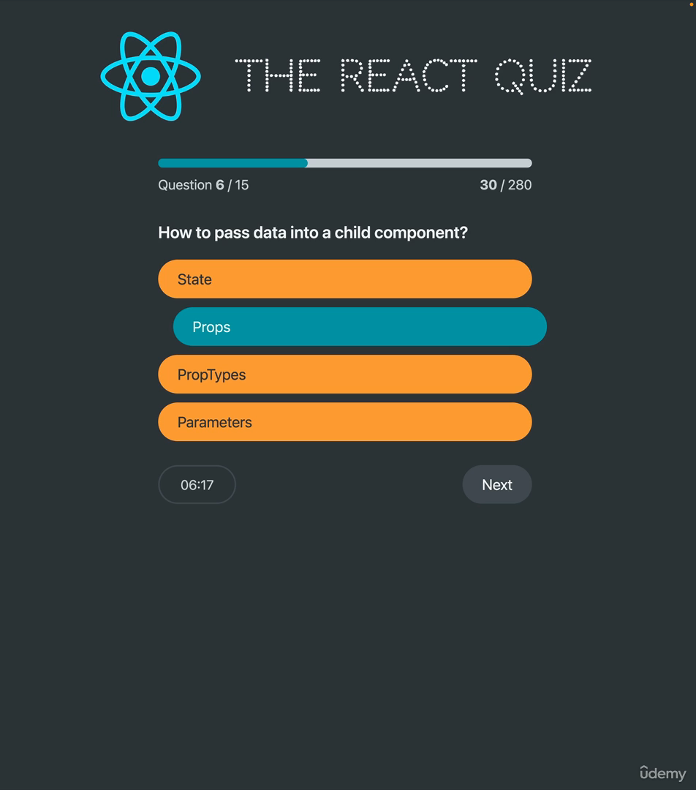

#### 186. [Section Overview](#186)

#### 187. [Yet Another Hook: useReducer](#187)

#### 188. [Managing Related Pieces of State](#188)

#### 189. [Managing State With useReducer](#189)

#### 190. [The "React Quiz" App](#190)

#### 191. [Loading Questions from a Fake API](#191)

#### 192. [Handling Loading, Error, and Ready Status](#192)

#### 193. [Starting a New Quiz](#193)

#### 194. [Displaying Questions](#194)

#### 195. [Handling New Answers](#195)

#### 196. [Moving to the Next Question](#196)

#### 197. [Displaying Progress](#197)

#### 198. [Finishing a Quiz](#198)

#### 199. [Restarting a Quiz](#199)

#### 200. [Setting Up a Timer With useEffect](#200)

#### 201. [Section Summary: useState vs. useReducer](#201)

#### 202. [CHALLENGE #1: Creating a Bank Account With useReducer](#202)

---

gimg

 

### 186. Section Overview

> Objective: Layout design

 

### 187. Yet Another Hook: useReducer

 

### 188. Managing Related Pieces of State

 

### 189. Managing State With useReducer

 

### 190. The "React Quiz" App

 

### 191. Loading Questions from a Fake API

 

### 192. Handling Loading, Error, and Ready Status

 

### 193. Starting a New Quiz

 

### 194. Displaying Questions

 

### 195. Handling New Answers

 

### 196. Moving to the Next Question

 

### 197. Displaying Progress

 

### 198. Finishing a Quiz

 

### 199. Restarting a Quiz

 

### 200. Setting Up a Timer With useEffect

 

### 201. Section Summary: useState vs. useReducer

 

### 202. CHALLENGE #1: Creating a Bank Account With useReducer

 
